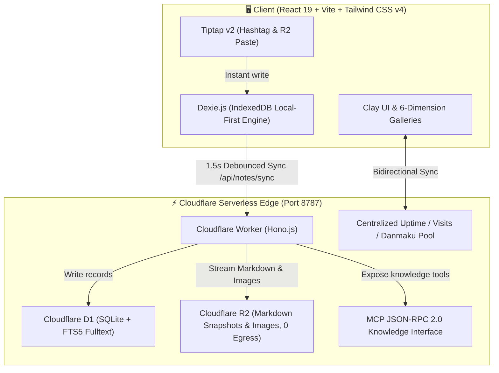

<div align="center">

# 🌸 TagMesh

### **Zero-Folder, Titleless, Keyboard-Driven Markdown Journal with Claymorphic Aesthetics & Serverless Edge**

*Organize knowledge organically through `#hashtags` — zero folders, zero title fatigue.*

<br/>

[](https://react.dev/)
[](https://tailwindcss.com/)
[](https://workers.cloudflare.com/)
[](https://developers.cloudflare.com/d1/)
[](https://developers.cloudflare.com/r2/)
[](https://modelcontextprotocol.io/)
[](./LICENSE)

<br/>

[✨ Features](#-key-features) • [🎨 6 Mood Themes](#-6-dimensional-mood-themes) • [🧭 6 Galleries](#-6-multi-dimensional-knowledge-galleries) • [💬 Live Danmaku](#-cross-device-real-time-danmaku--telemetry) • [⚡ Shortcuts](#-keyboard-first-shortcuts) • [🤖 MCP AI Server](#-model-context-protocol-mcp-server) • [🚀 Quick Start](#-quick-start--local-development)

<br/>

[🇬🇧 English](./README.md) • [🇨🇳 简体中文](./README_CN.md)

---

</div>

> [!TIP]
> **What does TagMesh do in 30 seconds?**  
> Say goodbye to title writer's block and deep directory folder fatigue. Tap a shortcut, start writing immediately, and scatter `#hashtags` naturally in your Markdown stream. TagMesh dynamically connects your fragmented inspirations into a bidirectional knowledge galaxy.

<br/>

## 🌟 Key Features

- 🏷️ **Zero Titles & Zero Folders**: Treat notes as pure Markdown text streams. Organization relies purely on `#hashtags` with smart first-line preview summaries.
- 🎨 **Tactile Claymorphism Aesthetics**: Rounded clay pills, spatial relief shadows, auditory soundscapes, and confetti particle bursts.
- 💬 **Cross-Device Shared Danmaku Plaza**: Barrages launched on your phone cruise instantly across desktop monitors with real-time reaction hearts.
- ⏱️ **Real Server Backend Uptime**: Synchronized backend startup timestamp (`SYSTEM_START_TIME`) across all clients with zero reset on refresh.
- 👥 **Authoritative Session Deduplicated Visits**: Session-based visitor tracking across devices with daily automatic rollovers.
- 🧭 **6 Multi-Dimensional Galleries**: Bento Grid, 3D Spatial Carousel, Galaxy Mesh Graph, Polaroid Photo Wall, Timeline Stream, and Freeform Canvas.
- ⚡ **Ultra-Fast Keyboard Flow**: `Cmd+K` Command Central, `Cmd+\` Sidebar, `Cmd+N` Instant Note, and `#` hashtag autocomplete.
- 🤖 **Native Serverless MCP AI Interface**: 8 standard tools ready for Claude Desktop and Cursor with zero in-app AI noise.

---

## ⚖️ Design Philosophy Comparison

```
       #travel                     #ideas
          \                         /
           \------- [ Note ] ------/
          /         /      \       \
   #photography    /        \     #cloudflare
                  /          \
             #journal       #todo
```

| Traditional Note Taking 😫 | The TagMesh Way ✨ |
| :--- | :--- |
| **Title Writer's Block**: Forced to come up with a title before jotting down a quick thought | **Zero Title Entity**: Just start typing. The first line automatically renders into a concise preview excerpt |
| **Folder Organization Fatigue**: Deep directory trees where notes get buried and forgotten | **Pure `#Hashtag` Topology Mesh**: Scatter `#tags` anywhere in your text. Notes form bidirectional associative graphs |
| **Multi-Device Data Silos**: Desktop notes isolated from mobile; mismatched telemetry | **LAN & Cloudflare Edge Sync**: Sub-second synchronization, unified system backend uptime & session deduplicated visitor analytics |
| **Boring Monochrome UI**: Stark black-and-white Markdown lacking tactile inspiration | **Claymorphism Joy**: Tactile rounded clay pills, playful micro-interactions, crisp soundscapes, and mood themes |
| **Clunky Embedded AI**: In-app chatbots cluttering your notes with useless prompts | **Clean Serverless MCP Interface**: Zero in-app AI bloat; native 8-tool MCP API ready for Claude Desktop and Cursor |

---

## 🎨 6 Dimensional Mood Themes

Switch effortlessly between 6 curated atmospheric themes:

| Theme | Atmosphere | Palette / Accent | Ideal Mood |
| :--- | :--- | :--- | :--- |
| 🌸 **Sakura Snow** | Drifting cherry blossoms and soft blush hues | `#FFF5F7` · Soft Blush | Daily journaling & reflections |
| 🌊 **Deep Ocean** | Abyssal oceanic blue and rhythmic sea foam | `#F0F9FF` · Cyan Abyss | Deep thinking & architecture |
| 🍵 **Zen Matcha** | Early spring tea gardens with organic herbal greens | `#F2FBF5` · Organic Herb | Reading notes & morning reviews |
| 🌌 **Cosmic Nebula** | Deep space stardust and violet astral trails | `#FDF4FF` · Astral Violet | Brainstorming & creativity |
| 👑 **Gilded Palace** | Imperial amber warmth and velvet elegance | `#FFFBEB` · Warm Amber | Milestone summaries & archiving |
| 🍦 **Vanilla Paper** | Tactile cream paper stationery with retro warmth | `#FAF7F2` · Retro Paper | Minimalist writing & vintage essays |

---

## 🧭 6 Multi-Dimensional Knowledge Galleries

<div align="center">

| Gallery View | Interaction Highlights | Best Use Case |
| :--- | :--- | :--- |
| **🗂️ Bento Grid** | Responsive modern bento layout with instant tag filters and word density tags | Quick vault browsing & tag filtering |
| **🎡 3D Spatial Carousel** | Spatial 3D cylinder rotating card deck with sound feedback and keyboard steering | Immersive card deck flipping |
| **🌌 Galaxy Mesh Graph** | Dynamic force-directed graph visualizing bidirectional relationships between notes | Exploring implicit connections between ideas |
| **🖼️ Polaroid Board** | Vintage pinned photo cards with organic rotation angles and paper clips | Moodboard & visual memories |
| **📅 Timeline Stream** | Chronological river tracking your thinking evolution across time | Thought evolution & history log |
| **🎨 Floating Canvas** | Draggable free-form spatial canvas for spatial brainstorming | Infinite free-form card mapping |

</div>

---

## 💬 Cross-Device Real-Time Danmaku & Telemetry

- **Sub-Second Broadcast**: Messages sent from mobile fly across desktop screens instantly with heart reactions 💖.
- **Anti-Collision Safe Lanes**: Responsive lane management (4 lanes on mobile, 6 on desktop) with instant curator moderation tools.
- **Real Backend Uptime**: Powered by `SYSTEM_START_TIME` recorded when the server process starts, synchronized across all devices without resetting on page reload.
- **Authoritative Deduplication**: Session-based visitor tracking across devices with daily midnight resets.

---

## ⚡ Keyboard-First Shortcuts

TagMesh is crafted for power keyboard users:

| Shortcut | Description | Scope |
| :--- | :--- | :--- |
| <kbd>Cmd</kbd> + <kbd>K</kbd> / <kbd>Ctrl</kbd> + <kbd>K</kbd> | **Open Global Command Central** (FTS5 search & quick create) | Global |
| <kbd>Cmd</kbd> + <kbd>\</kbd> / <kbd>Ctrl</kbd> + <kbd>\</kbd> | **Toggle Left TagMesh Slide-over Sidebar** | Global |
| <kbd>Cmd</kbd> + <kbd>N</kbd> / <kbd>Ctrl</kbd> + <kbd>N</kbd> | **Instant Create Blank Note** (100ms ultra-fast response) | Global |
| <kbd>Cmd</kbd> + <kbd>S</kbd> / <kbd>Ctrl</kbd> + <kbd>S</kbd> | **Manual Force Sync to Cloudflare D1/R2** | Global |
| <kbd>#</kbd> | **Trigger Hashtag Autocomplete Menu** | Editor |
| <kbd>Cmd</kbd> + <kbd>Shift</kbd> + <kbd>L</kbd> | **Toggle Bilingual UI** (English / 简体中文) | Global |
| <kbd>Cmd</kbd> + <kbd>/</kbd> / <kbd>Ctrl</kbd> + <kbd>/</kbd> | **Open Keyboard Shortcuts Cheatsheet Modal** | Global |
| <kbd>Esc</kbd> | **Close Modals, Command Palette or Sidebars** | Global |

---

## 🤖 Model Context Protocol (MCP) Server

TagMesh natively provides an edge **Model Context Protocol (JSON-RPC 2.0)** knowledge gateway at `/mcp` without in-app AI clutter.

### 🛠️ 8 Core MCP Server Tools

| Tool Name | Description | Parameters |
| :--- | :--- | :--- |
| `search_by_tag` | Search notes filtered by a specific hashtag | `tag` (string), `limit` (number) |
| `search_fulltext` | Execute high-performance SQLite FTS5 full-text query across all notes | `query` (string), `limit` (number) |
| `read_note` | Retrieve raw Markdown content, tags, and metadata by ID | `id` (string) |
| `create_or_update_note` | Create or overwrite a note stream remotely | `markdown` (string), `tags` (array), `id` (string) |
| `append_to_note` | Append paragraphs or hashtags to an existing note seamlessly | `id` (string), `contentToAppend` (string), `additionalTags` (array) |
| `delete_note` | Soft-delete or archive a note by ID | `id` (string) |
| `list_tags` | Retrieve all unique tags with note count frequencies | None |
| `get_workspace_stats` | Query repository note count, word count, and health metrics | None |

<details>
<summary><b>🔌 Claude Desktop Configuration (Click to expand)</b></summary>

Add to `claude_desktop_config.json`:

```json
{
  "mcpServers": {
    "tagmesh": {
      "command": "npx",
      "args": [
        "-y",
        "@modelcontextprotocol/server-fetch",
        "http://127.0.0.1:8787/mcp"
      ]
    }
  }
}
```
</details>

<details>
<summary><b>🔌 Cursor / VSCode Cline Configuration (Click to expand)</b></summary>

In Cursor Settings -> Features -> MCP Servers:
- **Type**: `sse` / `http`
- **URL**: `http://127.0.0.1:8787/mcp`
</details>

---

## 🏗️ Serverless Full-Stack Edge Architecture



---

## 🚀 Quick Start & Local Development

### 1. Clone & Install
```bash
git clone https://github.com/SaulGoodManC99/TagMesh.git
cd TagMesh
npm install
```

### 2. Start Development Servers
```bash
# Start frontend with LAN access on 0.0.0.0:5173
npm run dev

# Start Cloudflare Worker backend on port 8787
npm run worker:dev
```

### 3. Build Production Bundle
```bash
npm run build
```

### 4. Initialize Database & Edge Deploy
```bash
# Initialize local D1 SQLite schema & FTS5 virtual table
npm run db:init

# Deploy to Cloudflare Workers edge network
npm run worker:deploy
```

---

## 📄 License

Distributed under the [MIT License](./LICENSE).

<div align="center">

Crafted with 💖 and Clay Magic by **[SaulGoodManC99](https://github.com/SaulGoodManC99)**

</div>
