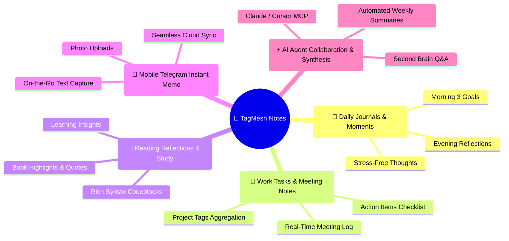

<div align="center">

# 🌸 TagMesh Notes

### **Capture Fleeting Thoughts · Daily Life & Work Memos · Tag-Woven Mesh**
### **Ditch folder anxiety and title friction. Let thoughts weave naturally across a multidimensional tag mesh.**

<br/>

[](./LICENSE)
[](https://react.dev/)
[](https://www.typescriptlang.org/)
[](https://tailwindcss.com/)
[](https://workers.cloudflare.com/)
[](https://dexie.org/)
[](https://modelcontextprotocol.io/)

<br/>

[🌐 Live Demo Experience](https://tagmesh.top) • [🇨🇳 简体中文文档](./README_CN.md) • [🇬🇧 English Docs](./README.md) • [🌱 Application Scenarios](#-5-core-application-scenarios) • [🚀 5-Min Deployment](#-5-minute-quick-deployment-guide) • [🔄 Automated CI/CD](#-github-actions-automated-cicd-deployment)

</div>

---

> 💡 **100% Free & Open-Source · Zero Server Cost**  
> TagMesh operates entirely within Cloudflare's free tiers (Workers + D1 SQLite + R2 Object Storage). Zero VPS subscriptions, 100% local-first data privacy, and full data ownership.

---

## 💡 Why TagMesh?

Traditional note-taking tools often inflict heavy **cognitive friction** before you can even begin writing:
* 🌲 **Folder-Heavy Apps (Obsidian / Notion / Evernote)**: You are forced to pick a folder and invent a title beforehand. This rigid friction kills fleeting sparks of inspiration.
* 🔒 **Commercial Memo Tools (Flomo / Yuque)**: Your data is locked in proprietary third-party clouds with expensive subscriptions and zero native AI Agent connectivity.
* 📄 **Plain Text Markdown Tools**: Monolithic, flat, and lacking tactile delight or multi-dimensional visual roaming.

**TagMesh restores note-taking to its most natural state:**
1. **Zero Folders · Zero Titles**: Your thoughts are raw streams. Type `#hashtags` anywhere in the text to weave a living knowledge network.
2. **Distraction-Free Pure Workspace**: No text-selection popups; type `:` to trigger clean, rich emotions and symbols autocomplete.
3. **Dual Immersive Gallery Views**: Seamlessly switch between Bento Masonry Waterfall (column-bucketing layout) and Chronological Timeline Stream.
4. **Mobile Second Brain via Telegram Bot**: Text or send photos to your private Telegram bot on the go; 0-delay instant sync into your knowledge base.
5. **Native AI-Native MCP Gateway**: Built-in Model Context Protocol (MCP) server allowing Claude Desktop, Cursor, and AI Agents to query, synthesize, and create notes.

---

## 🌱 5 Core Application Scenarios



### 1. 🌅 Daily Journals & Fleeting Moments
* **Scenario**: Capture 3 morning goals, gratitude notes, evening thoughts, and travel memories.
* **Experience**: Open the editor and write immediately with soothing tactile sound effects and subtle ambient particles.

### 2. 💼 Work Tasks & Meeting Notes
* **Scenario**: Fast-paced meetings and daily standup action items.
* **Experience**: Type `#todo` `#meeting` `#ProjectAlpha` in prose. Click any tag to aggregate and review all related items in seconds.

### 3. 📖 Reading Reflections & Learning Logs
* **Scenario**: Reading books, articles, or technical docs with key quotes, insights, and code snippets.
* **Experience**: Full Markdown support with syntax-highlighted code blocks, checklists, and responsive formatting.

### 4. 🤖 Mobile Capture via Telegram Bot
* **Scenario**: When commuting, walking, or traveling, message your private Telegram Bot with text or photos.
* **Experience**: Bot uploads images to R2, saves notes to D1, and syncs instantly to your TagMesh workspace.

### 5. ⚡ AI Agent Deep Collaboration (MCP)
* **Scenario**: Connect Claude Desktop, Cursor, or AI assistants to synthesize knowledge clusters or generate weekly reports.
* **Experience**: Native Model Context Protocol (MCP) support with secure Bearer Token authentication.

---

## 🚀 5-Minute Quick Deployment Guide

Deploy your private TagMesh instance in 5 minutes with a free [Cloudflare](https://dash.cloudflare.com/) account!

### Prerequisites
1. Free [Cloudflare Account](https://dash.cloudflare.com/);
2. [Node.js (v20+)](https://nodejs.org/) and Git.

---

### Step 1: Clone Repository & Install Dependencies

```bash
# 1. Clone repository
git clone https://github.com/SaulGoodManC99/TagMesh.git
cd TagMesh

# 2. Install dependencies
npm install
```

---

### Step 2: Create Cloudflare D1 Database & R2 Bucket

```bash
# 1. Login to Cloudflare Wrangler
npx wrangler login

# 2. Create D1 Database (save the printed database_id)
npx wrangler d1 create tagmesh-db

# 3. Create R2 Bucket (for images and backups)
npx wrangler r2 bucket create tagmesh-bucket

# 4. Initialize Database Schema & FTS5 Index
npx wrangler d1 execute tagmesh-db --remote --file=./schema.sql
```

---

### Step 3: Configure `wrangler.toml`

Open `wrangler.toml` in the project root and insert your `database_id`:

```toml
name = "tagmesh-markdown"
main = "worker/index.ts"
compatibility_date = "2024-11-01"
compatibility_flags = ["nodejs_compat"]

[assets]
directory = "./dist"
not_found_handling = "single-page-application"

[[d1_databases]]
binding = "DB"
database_name = "tagmesh-db"
database_id = "YOUR_D1_DATABASE_ID" # 👈 Replace with your real database_id

[[r2_buckets]]
binding = "BUCKET"
bucket_name = "tagmesh-bucket"

[vars]
ENVIRONMENT = "production"
MCP_AUTH_TOKEN = "your_custom_secret_mcp_bearer_token"
```

---

### Step 4: Set Admin Password & Telegram Bot (Optional)

```bash
# Set Admin Password (for workspace curator access & private notes)
npx wrangler secret put ADMIN_PASSWORD

# Telegram Second Brain Bot (Optional)
npx wrangler secret put TELEGRAM_BOT_TOKEN
npx wrangler secret put TELEGRAM_ALLOWED_USER_IDS  # Your numeric Telegram user ID
```

---

### Step 5: Build & Deploy

```bash
# Build SPA frontend bundle
npm run build

# Deploy to Cloudflare Workers Edge
npx wrangler deploy worker/index.ts
```

Your live URL (e.g. `https://tagmesh-markdown.xxx.workers.dev`) will be printed in the terminal!

---

## 🔄 GitHub Actions Automated CI/CD Deployment

With GitHub Actions configured, every time you `git push` to your repository, GitHub will automatically build and deploy the latest version to Cloudflare Workers.

### 1. Get Cloudflare Credentials
1. Go to [Cloudflare Dashboard](https://dash.cloudflare.com/);
2. Click **User Profile (top right) -> My Profile -> API Tokens**;
3. Click **Create Token**, pick the **"Edit Cloudflare Workers"** template, create and copy the `API Token`;
4. Copy your `Account ID` from the Cloudflare dashboard overview page.

### 2. Add Secrets in GitHub Repository
In your GitHub repo: **Settings -> Secrets and variables -> Actions -> New repository secret**, add the following 3 variables:

| Secret Name | Description | Example |
| :--- | :--- | :--- |
| `CLOUDFLARE_API_TOKEN` | Cloudflare API Token | `vN8...` |
| `CLOUDFLARE_ACCOUNT_ID` | Cloudflare Account ID | `a1b2c3...` |
| `CLOUDFLARE_D1_DATABASE_ID` | Your D1 Database ID | `132a4651-9da7-...` |

### 3. Built-in Workflow File
The repository already includes [`.github/workflows/deploy.yml`](./.github/workflows/deploy.yml). Any push to the `main` branch triggers an automated build & zero-downtime edge deployment:

```yaml
name: Deploy TagMesh to Cloudflare Workers

on:
  push:
    branches: [ main ]
  workflow_dispatch:

jobs:
  deploy:
    runs-on: ubuntu-latest
    steps:
      - uses: actions/checkout@v4
      - uses: actions/setup-node@v4
        with:
          node-version: 20
          cache: 'npm'
      - run: npm install
      - run: npm run build
      - name: Inject D1 ID
        run: |
          if [ -n "${{ secrets.CLOUDFLARE_D1_DATABASE_ID }}" ]; then
            sed -i "s/D1_DATABASE_ID_PLACEHOLDER/${{ secrets.CLOUDFLARE_D1_DATABASE_ID }}/g" wrangler.toml
          fi
      - uses: cloudflare/wrangler-action@v3
        with:
          apiToken: ${{ secrets.CLOUDFLARE_API_TOKEN }}
          accountId: ${{ secrets.CLOUDFLARE_ACCOUNT_ID }}
          command: deploy worker/index.ts
```

---

## 📄 License

This project is licensed under the [MIT License](./LICENSE). Feel free to Star, Fork, and contribute!
