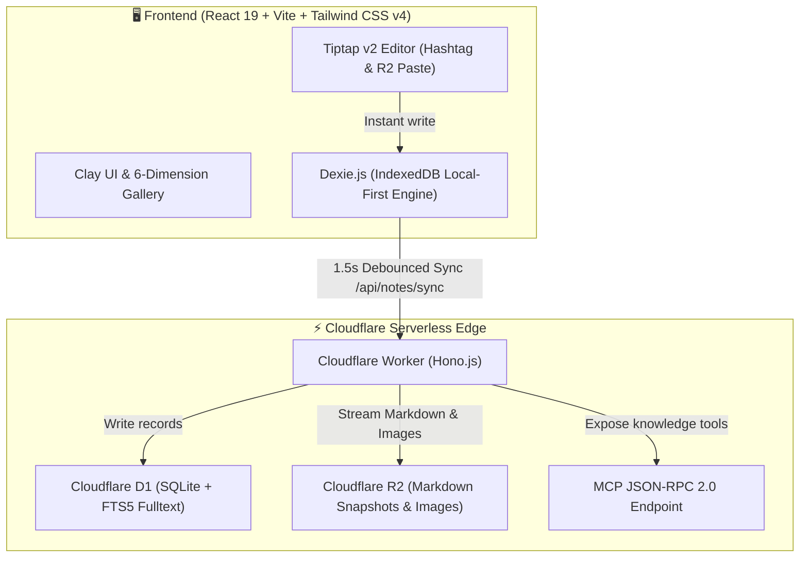

# TagMesh 🌸

<div align="center">


[](https://react.dev/)
[](https://tailwindcss.com/)
[](https://workers.cloudflare.com/)
[](https://developers.cloudflare.com/d1/)
[](https://developers.cloudflare.com/r2/)
[](https://dexie.org/)
[](https://opensource.org/licenses/MIT)

**A keyboard-driven, folderless & titleless Markdown journal system with Claymorphic aesthetics, multi-device sync, dynamic Danmaku plaza, and Model Context Protocol (MCP) serverless interface.**

[English](./README.md) • [简体中文](./README_CN.md)

</div>

---

## 🌟 Highlights & Philosophy

TagMesh reimagines personal note-taking and digital gardening through a **fluid, tag-woven network**, moving beyond hierarchical folder fatigue and rigid title structures.

```
       #travel                     #ideas
          \                         /
           \------- [ Note ] ------/
          /         /      \       \
   #photography    /        \     #cloudflare
                  /          \
             #journal       #todo
```

### 1. 🏷️ Zero Titles & Zero Folders (Tag-Woven Mesh)
- **Titleless & Folderless**: Notes are pure Markdown streams. Categorization happens organically anywhere in your text via `#hashtags` (e.g. `#cloudflare`, `#ideas`, `#todo`).
- **Inline Badge Rendering**: Tiptap automatically renders `#tag` into clickable interactive clay badges.
- **Smart `#` Autocomplete**: Typing `#` opens an intelligent autocomplete suggestion dropdown for instant reuse of existing tags.

### 2. 🎨 Claymorphism Aesthetic & Dimensional Mood Themes
- **Claymorphic UI**: Ultra-smooth tactile feedback, rounded clay pills, playful micro-interactions, and spatial shadows.
- **Mood Themes**: Switch seamlessly between 6 dimensional themes:
  - 🌸 **Sakura Snow** (*Cherry blossoms & soft blush light*)
  - 🌊 **Deep Ocean** (*Cyan abyssal waves*)
  - 🍵 **Zen Matcha** (*Quiet tea gardens & organic earth*)
  - 🌌 **Cosmic Nebula** (*Stardust & deep space violet*)
  - 👑 **Gilded Palace** (*Imperial amber & velvet elegance*)
  - 🍦 **Vanilla Paper** (*Warm cream & tactile handmade stationery*)

### 3. 💬 Cross-Device Real-Time Danmaku Plaza
- **Atmospheric Floating Barrage**: Experience community thoughts, inspirations, and ambient note excerpts floating across dynamic tracks.
- **Multi-Device Unified Sync**: Barrages launched from mobile appear instantly on desktop screens, with real-time reaction hearts and celebration particles.
- **Anti-Collision Safe Tracks**: Intelligent multi-lane cruise collision avoidance, responsive track scaling (4 lanes on mobile, 6 on desktop), and instant curator moderation.

### 4. 🧭 6 Dimension Gallery Views
Explore your knowledge garden across 6 distinct perspectives:
- **🗂️ Bento Grid**: Responsive modern bento layout with tag filters and word density tags.
- **🎡 3D Carousel**: Spatial 3D cylinder rotating card deck with sound feedback.
- **🌌 Galaxy Mesh**: Dynamic force-directed graph visualizing relationships between tags and interconnected notes.
- **🖼️ Polaroid Board**: Casual vintage pinned cards with rotation offsets and paper clips.
- **📅 Timeline Stream**: Chronological river tracking your thinking evolution.
- **🎨 Floating Canvas**: Draggable free-form spatial canvas.

### 5. ⚡ Keyboard-First & Command Palette (`Cmd + K`)
- **Global Command Central (`Cmd + K`)**: Instant FTS5 full-text search, tag switching, or type text and hit `Enter` to create notes in 100ms.
- **Rich Shortcut Engine**: `Cmd + \` to toggle sidebar, `Cmd + N` for new note, `Cmd + S` for instant sync, `Cmd + Shift + L` for bilingual switch.

### 6. 🔌 Pure Serverless MCP Knowledge Interface
- Integrated **Model Context Protocol (MCP)** endpoint at `/mcp` with Bearer Token authentication.
- Seamlessly query and create notes from **Claude Desktop**, **Cursor**, or any external AI agent without clunky embedded chat UIs.

---

## ⚡ Keyboard Shortcuts Cheat Sheet

| Shortcut | Description | Scope |
| :--- | :--- | :--- |
| **`Cmd + K` / `Ctrl + K`** | Open Global Command Palette (Fulltext Search & Quick Create) | Global |
| **`Cmd + \` / `Ctrl + \`** | Toggle Left TagMesh Slide-over Sidebar | Global |
| **`Cmd + N` / `Ctrl + N`** | Instant Create Blank Note | Global |
| **`Cmd + S` / `Ctrl + S`** | Trigger Manual Zero-Sync to Cloudflare D1/R2 | Global |
| **`#`** | Trigger Hashtag Autocomplete Menu | Editor |
| **`Cmd + Shift + L`** | Toggle Bilingual UI (English / 简体中文) | Global |
| **`Cmd + /` / `Ctrl + /`** | Open Keyboard Shortcuts Cheatsheet Modal | Global |
| **`Esc`** | Close Modals, Command Palette or Sidebars | Global |

---

## 🏗️ Architecture & Tech Stack



- **Frontend**: React 19, Vite, Tailwind CSS v4, Dexie.js (IndexedDB), Tiptap v2, `cmdk`, Lucide React, Canvas Confetti.
- **Backend / Edge**: Cloudflare Workers, Hono.js.
- **Database**: Cloudflare D1 (SQLite + FTS5 fulltext search virtual tables).
- **Object Storage**: Cloudflare R2 (0 Egress Fees image hosting and `.md` storage).
- **AI Protocol**: Model Context Protocol (MCP) JSON-RPC 2.0.

---

## 🚀 Quick Start

### 1. Prerequisites
- [Node.js](https://nodejs.org/) (v18+ recommended)
- [Wrangler CLI](https://developers.cloudflare.com/workers/wrangler/) (installed automatically via devDependencies)

### 2. Installation
```bash
# Clone the repository
git clone https://github.com/SaulGoodManC99/TagMesh.git
cd TagMesh

# Install dependencies
npm install
```

### 3. Development
```bash
# Start frontend development server (supports LAN access at 0.0.0.0:5173)
npm run dev

# Start Cloudflare Worker backend locally
npm run worker:dev
```

### 4. Build for Production
```bash
# Type check and build Vite bundle
npm run build
```

### 5. Cloudflare D1 & Worker Deployment
```bash
# Initialize local D1 database schema
npm run db:init

# Deploy Worker to Cloudflare Edge
npm run worker:deploy
```

---

## 🤖 MCP (Model Context Protocol) Setup

TagMesh exposes standard MCP tools at `/mcp` for external AI clients:

1. In **Claude Desktop** (`claude_desktop_config.json`):
```json
{
  "mcpServers": {
    "tagmesh": {
      "command": "npx",
      "args": [
        "-y",
        "@modelcontextprotocol/server-fetch",
        "http://127.0.0.1:8787/mcp"
      ]
    }
  }
}
```

2. Available Tools:
- `search_by_tag`: Search notes by specific hashtags.
- `search_fulltext`: FTS5 full-text query across all notes.
- `read_note`: Retrieve note markdown and metadata by ID.
- `create_or_update_note`: Create or update note streams remotely.

---

## 📄 License

Distributed under the **MIT License**. See `LICENSE` for more information.

<div align="center">
Crafted with 💖 and clay magic by <b>SaulGoodManC99</b>
</div>
