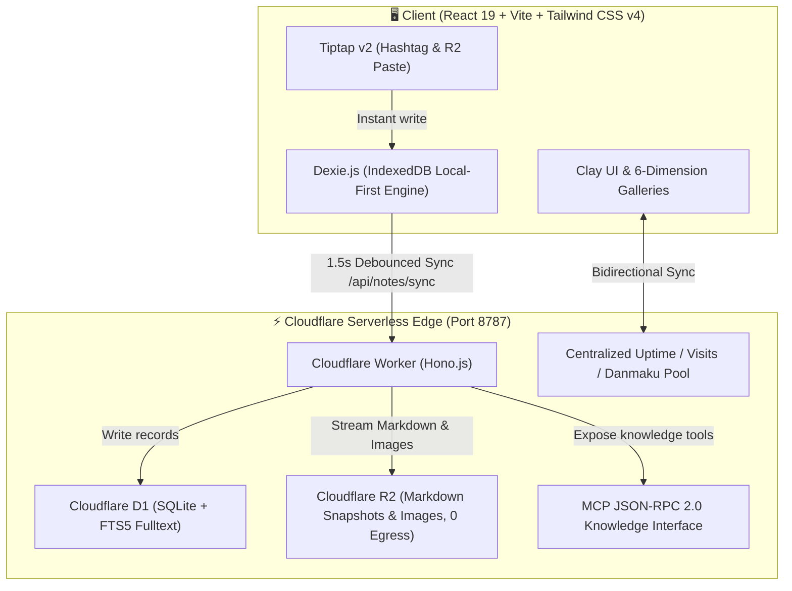

<div align="center">

# 🌸 TagMesh
### *Zero-Folder, Titleless, Keyboard-Driven Markdown Journal with Claymorphic Aesthetics & Serverless Edge*

<br/>

[](https://react.dev/)
[](https://tailwindcss.com/)
[](https://workers.cloudflare.com/)
[](https://developers.cloudflare.com/d1/)
[](https://developers.cloudflare.com/r2/)
[](https://modelcontextprotocol.io/)
[](https://opensource.org/licenses/MIT)

<br/>

**Say goodbye to title anxiety and deep folder fatigue.**  
Type anywhere in your raw Markdown with `#hashtags` to organically weave your ideas into a dynamic knowledge galaxy.  
Engineered with **tactile Claymorphism aesthetics**, a **cross-device live Danmaku plaza**, **6 multi-dimensional knowledge galleries**, and a **serverless MCP AI knowledge gateway**.

[🇬🇧 English](./README.md) • [🇨🇳 简体中文](./README_CN.md)

</div>

---

## 📖 Table of Contents

- [🌟 Why TagMesh? (Core Pain Points & Innovations)](#-why-tagmesh-core-pain-points--innovations)
- [🎨 Claymorphic Aesthetics & 6 Dimensional Mood Themes](#-claymorphic-aesthetics--6-dimensional-mood-themes)
- [💬 Cross-Device Real-Time Danmaku Plaza & Live Telemetry](#-cross-device-real-time-danmaku-plaza--live-telemetry)
- [🧭 6 Multi-Dimensional Knowledge Galleries](#-6-multi-dimensional-knowledge-galleries)
- [⚡ Keyboard-First Ultra-Fast Workflow](#-keyboard-first-ultra-fast-workflow)
- [🤖 Model Context Protocol (MCP) AI Toolset](#-model-context-protocol-mcp-ai-toolset)
- [🏗️ Serverless Full-Stack Edge Architecture](#️-serverless-full-stack-edge-architecture)
- [🚀 Local Development & Quick Start](#-local-development--quick-start)
- [📄 License](#-license)

---

## 🌟 Why TagMesh? (Core Pain Points & Innovations)

Traditional note-taking apps interrupt raw thought flows with tedious organizational ceremonies. TagMesh breaks the mold:

| Traditional Note Taking 😫 | The TagMesh Way ✨ |
| :--- | :--- |
| **Title Writer's Block**: Forced to come up with a title before jotting down a quick thought | **Zero Title Entity**: Just start typing. The first line automatically renders into a concise preview excerpt |
| **Folder Organization Fatigue**: Deep directory trees where notes get buried and forgotten | **Pure `#Hashtag` Topology Mesh**: Scatter `#tags` anywhere in your text. Notes form bidirectional associative graphs |
| **Multi-Device Data Silos**: Desktop notes isolated from mobile; mismatched telemetry | **LAN & Cloudflare Edge Sync**: Sub-second synchronization, unified system backend uptime & session deduplicated visitor analytics |
| **Boring Monochrome UI**: Stark black-and-white Markdown lacking tactile inspiration | **Claymorphism Joy**: Tactile rounded clay pills, playful micro-interactions, crisp soundscapes, and mood themes |
| **Clunky Embedded AI**: In-app chatbots cluttering your notes with useless prompts | **Clean Serverless MCP Interface**: Zero in-app AI bloat; native 8-tool MCP API ready for Claude Desktop and Cursor |

```
       #travel                     #ideas
          \                         /
           \------- [ Note ] ------/
          /         /      \       \
   #photography    /        \     #cloudflare
                  /          \
             #journal       #todo
```

---

## 🎨 Claymorphic Aesthetics & 6 Dimensional Mood Themes

TagMesh features tactile **Claymorphism UI design** with spatial lighting, rounded capsules, and auditory feedback. Every interaction is rewarded with particle bursts and playful chime effects.

Switch between **6 immersive dimensional mood themes** on the fly:

- 🌸 **Sakura Snow**: Drifting cherry blossoms and soft blush hues.
- 🌊 **Deep Ocean**: Abyssal oceanic blue and rhythmic sea foam.
- 🍵 **Zen Matcha**: Early spring tea gardens with organic herbal greens.
- 🌌 **Cosmic Nebula**: Deep space stardust and violet astral trails.
- 👑 **Gilded Palace**: Imperial amber warmth and velvet elegance.
- 🍦 **Vanilla Paper**: Tactile cream paper stationery with retro warmth.

---

## 💬 Cross-Device Real-Time Danmaku Plaza & Live Telemetry

### 1. 🚀 Atmospheric Shared Danmaku Plaza
- **Drifting Stream of Thoughts**: Public excerpts, community reflections, and live ideas cruise across smooth multi-lane tracks.
- **Cross-Device Broadcast**: Launch a danmaku from your phone, and it flies instantly across your desktop monitor in real time with synchronized heart reactions 💖.
- **Anti-Collision Safe Lanes**: Responsive lane management (4 lanes on mobile, 6 on desktop) with instant curator moderation tools.

### 2. ⏱️ Real Backend System Uptime
- Say goodbye to fake local tab counters. The backend service records `SYSTEM_START_TIME` when the server starts, and all devices display the synchronized system uptime (e.g. `8h 48m 32s`) with zero reset on page refreshes.

### 3. 👥 Authoritative Visitor Deduplication
- Server-managed Session deduplication tracks global **Total Visits** and **Today's Visits** (with automatic midnight rollovers), unified across all clients.

---

## 🧭 6 Multi-Dimensional Knowledge Galleries

Explore your knowledge garden from 6 distinct perspectives:

1. **🗂️ Bento Grid**: Responsive modern bento layout with instant tag filters and word density tags.
2. **🎡 3D Carousel**: Spatial 3D cylinder rotating card deck with sound feedback and keyboard steering.
3. **🌌 Galaxy Mesh**: Dynamic force-directed graph visualizing bidirectional relationships between tags and interconnected notes.
4. **🖼️ Polaroid Board**: Vintage pinned photo cards with organic rotation angles and paper clips.
5. **📅 Timeline Stream**: Chronological river tracking your thinking evolution.
6. **🎨 Floating Canvas**: Draggable free-form spatial canvas for spatial brainstorming.

---

## ⚡ Keyboard-First Ultra-Fast Workflow

TagMesh is crafted for power keyboard users:

| Shortcut | Description | Scope |
| :--- | :--- | :--- |
| **`Cmd + K` / `Ctrl + K`** | Open Global Command Central (FTS5 fulltext search & instant create) | Global |
| **`Cmd + \` / `Ctrl + \`** | Toggle Left TagMesh Slide-over Sidebar | Global |
| **`Cmd + N` / `Ctrl + N`** | Instant Create Blank Note (100ms ultra-fast response) | Global |
| **`Cmd + S` / `Ctrl + S`** | Trigger Manual Zero-Sync to Cloudflare D1/R2 | Global |
| **`#`** | Trigger Hashtag Autocomplete Dropdown Menu | Editor |
| **`Cmd + Shift + L`** | Toggle Bilingual UI (English / 简体中文) | Global |
| **`Cmd + /` / `Ctrl + /`** | Open Keyboard Shortcuts Cheatsheet Modal | Global |
| **`Esc`** | Close Modals, Command Palette or Sidebars | Global |

---

## 🤖 Model Context Protocol (MCP) AI Toolset

TagMesh natively provides an edge **Model Context Protocol (JSON-RPC 2.0)** knowledge gateway at `/mcp` without in-app AI clutter.

### 🛠️ 8 Core MCP Server Tools

| Tool Name | Description |
| :--- | :--- |
| `search_by_tag` | Search notes filtered by a specific hashtag |
| `search_fulltext` | Execute high-performance SQLite FTS5 full-text query across all notes |
| `read_note` | Retrieve raw Markdown content, tags, and metadata by ID |
| `create_or_update_note` | Create or overwrite a note stream remotely |
| `append_to_note` | **(NEW)** Append paragraphs or hashtags to an existing note seamlessly |
| `delete_note` | **(NEW)** Soft-delete or archive a note by ID |
| `list_tags` | **(NEW)** Retrieve all unique tags with note count frequencies |
| `get_workspace_stats` | **(NEW)** Query repository note count, word count, and health metrics |

### 🔌 Claude Desktop Configuration (`claude_desktop_config.json`)

```json
{
  "mcpServers": {
    "tagmesh": {
      "command": "npx",
      "args": [
        "-y",
        "@modelcontextprotocol/server-fetch",
        "http://127.0.0.1:8787/mcp"
      ]
    }
  }
}
```

---

## 🏗️ Serverless Full-Stack Edge Architecture



---

## 🚀 Local Development & Quick Start

### 1. Prerequisites
- [Node.js](https://nodejs.org/) (v18+ recommended)
- [Git](https://git-scm.com/)

### 2. Clone & Install
```bash
git clone https://github.com/SaulGoodManC99/TagMesh.git
cd TagMesh
npm install
```

### 3. Start Development Servers
```bash
# Start frontend with LAN access on 0.0.0.0:5173
npm run dev

# Start Cloudflare Worker backend on port 8787
npm run worker:dev
```

### 4. Build Production Bundle
```bash
npm run build
```

### 5. Initialize Database & Edge Deploy
```bash
# Initialize local D1 SQLite schema & FTS5 virtual table
npm run db:init

# Deploy to Cloudflare Workers edge network
npm run worker:deploy
```

---

## 📄 License

Distributed under the [MIT License](./LICENSE).

<div align="center">

Crafted with 💖 and Clay Magic by **[SaulGoodManC99](https://github.com/SaulGoodManC99)**

</div>
