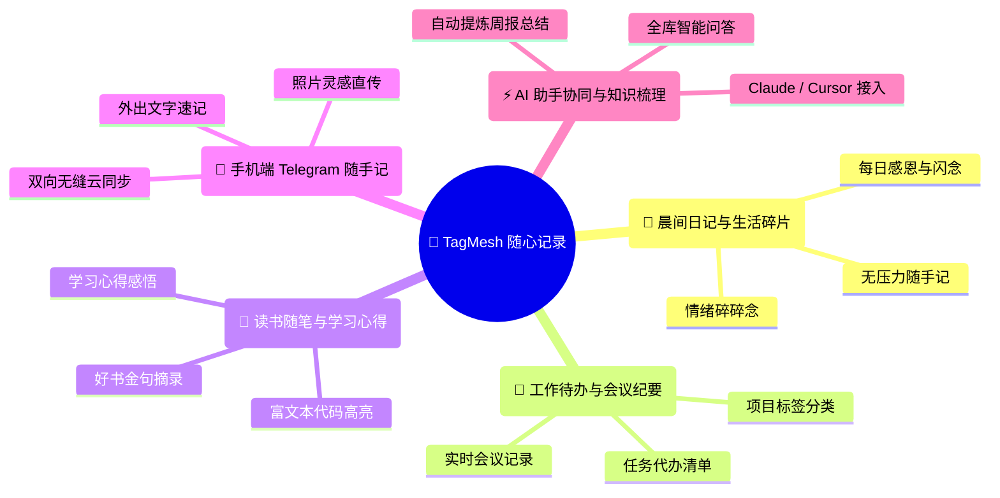

<div align="center">

# 🌸 TagMesh 随心笔记

### **随心记录 · 灵感闪念 · 个人生活与工作备忘**
### **告别文件夹焦虑与起标题内耗，让灵感在 `#标签` 编织的立体思维网中自由沉淀。**

<br/>

[](./LICENSE)
[](https://react.dev/)
[](https://www.typescriptlang.org/)
[](https://tailwindcss.com/)
[](https://workers.cloudflare.com/)
[](https://dexie.org/)
[](https://modelcontextprotocol.io/)

<br/>

[🌐 在线演示体验 (Live Demo)](https://tagmesh.top) • [🇨🇳 简体中文](./README_CN.md) • [🇬🇧 English](./README.md) • [🌱 应用场景](#-五大核心应用场景) • [🚀 快速部署教程](#-5-分钟极速部署指南) • [🔄 自动更新 CI/CD](#-github-actions-全自动更新部署)

</div>

---

> 💡 **100% 免费开源 & 零服务器成本**  
> TagMesh 完全基于 Cloudflare 免费资源运行（Workers + D1 数据库 + R2 存储），无需购买云服务器 VPS，数据本地优先安全加密，拥有完全自主权。

---

## 💡 为什么需要 TagMesh？

在日常记录中，我们常常在动笔前就陷入了烦人的**阻碍与内耗**：
* 🌲 **传统树状笔记**：每次动笔前都要先思考“放进哪个文件夹”、起什么标题，琐碎的归档流程打断了即时的灵感。
* 🔒 **商业备忘软件**：数据锁在第三方厂商的云端，导出困难，订阅费昂贵，且无法与自己的 AI 助手自由打通。
* 📄 **传统纯文本工具**：界面单调，缺乏视觉上的温度与回顾时的愉悦感。

**TagMesh 让记录回归最自然的状态：**
1. **零文件夹 · 零强制标题**：打开就写，正文随时敲击 `#标签` 自动归类，首行智能提炼为卡片摘要。
2. **纯净无干扰工作台**：选词无遮挡，键盘输入 `:` 即可快捷插入纯粹丰富的情绪表情与符号。
3. **多维沉浸式画廊展台**：提供便当瀑布流、时光卷轴等多种展厅视角，回顾笔记像翻阅手帐般赏心悦目。
4. **全天候跨端闪念收集**：外出时直接发消息给 Telegram 机器人，0 延迟自动存入个人知识库。
5. **AI 助手无缝联动**：原生内置标准 MCP 网关，Claude、Cursor、Antigravity 等 AI Agent 可直接读写检索全库。

---

## 🌱 五大核心应用场景



### 1. 🌅 晨间日记与生活碎片
* **场景**：清晨记录当日的三个小目标、睡前的生活感悟、旅途中的所见所闻。
* **体验**：打开工作台直接书写，配合温润的触感音效与背景微动粒子，让记录成为一天中最治愈的仪式。

### 2. 💼 工作待办与会议纪要
* **场景**：开会时快速捕获讨论重点与行动项。
* **体验**：在正文中随手打上 `#待办` `#项目A` `#会议纪要`，标签自动归纳，点击标签一秒筛选所有关联笔记。

### 3. 📖 读书随笔与学习心得
* **场景**：阅读书籍、文章或技术文档时随手记录金句与灵感。
* **体验**：支持完整的 Markdown 富文本语法、代码块高亮与任务清单，排版精致雅观。

### 4. 🤖 手机外出 Telegram 闪念速记
* **场景**：在通勤、散步或外出时，随时在手机 Telegram 聊天框中给专属 Bot 发送文字或随手拍的照片。
* **体验**：无需打开网页，Bot 自动将文字与图片上传至私有存储并同步到 TagMesh，无缝衔接灵感第二大脑。

### 5. ⚡ AI 助手 (MCP) 深度协同
* **场景**：让 Claude Desktop、Cursor 或本地 AI Agent 协助梳理知识脉络、生成每周工作总结。
* **体验**：内置标准 MCP 协议，通过安全的 Bearer Token 授权，AI 即可智能检索、分析并归纳你的所有笔记。

---

## 🚀 5 分钟极速部署指南

只需一个免费的 [Cloudflare](https://dash.cloudflare.com/) 账号，即可零成本一键自建专属笔记系统！

### 准备工作
1. 注册并登录 [Cloudflare 官网](https://dash.cloudflare.com/)；
2. 安装 [Node.js (v20+)](https://nodejs.org/) 与 Git。

---

### 第一步：克隆仓库与安装依赖

```bash
# 1. 克隆本仓库到本地
git clone https://github.com/SaulGoodManC99/TagMesh.git
cd TagMesh

# 2. 安装依赖包
npm install
```

---

### 第二步：创建 Cloudflare D1 数据库与 R2 存储桶

```bash
# 1. 登录 Cloudflare 授权
npx wrangler login

# 2. 创建 D1 数据库（记录终端输出的 database_id）
npx wrangler d1 create tagmesh-db

# 3. 创建 R2 图片存储桶（用于截图与媒体存储）
npx wrangler r2 bucket create tagmesh-bucket

# 4. 初始化数据库表结构与全文检索索引
npx wrangler d1 execute tagmesh-db --remote --file=./schema.sql
```

---

### 第三步：配置 `wrangler.toml`

打开项目根目录下的 `wrangler.toml` 文件，填入上面获得的 `database_id`：

```toml
name = "tagmesh-markdown"
main = "worker/index.ts"
compatibility_date = "2024-11-01"
compatibility_flags = ["nodejs_compat"]

[assets]
directory = "./dist"
not_found_handling = "single-page-application"

[[d1_databases]]
binding = "DB"
database_name = "tagmesh-db"
database_id = "你的_D1_DATABASE_ID" # 👈 替换为您真实的 database_id

[[r2_buckets]]
binding = "BUCKET"
bucket_name = "tagmesh-bucket"

[vars]
ENVIRONMENT = "production"
MCP_AUTH_TOKEN = "自定义一段长随机字符串作为_MCP_TOKEN"
```

---

### 第四步：设置管理员密码与 Telegram Bot（可选）

```bash
# 设置管理员访问密码（用于后台管理与私密笔记保护）
npx wrangler secret put ADMIN_PASSWORD

# 如果需要 Telegram 随手记机器人（可选）
npx wrangler secret put TELEGRAM_BOT_TOKEN
npx wrangler secret put TELEGRAM_ALLOWED_USER_IDS  # 填入你的 Telegram 数字 ID
```

---

### 第五步：本地构建与上线部署

```bash
# 构建前端静态文件
npm run build

# 一键部署至 Cloudflare 全球边缘节点
npx wrangler deploy worker/index.ts
```

部署完成后，命令行将输出您的专属域名（例如 `https://tagmesh-markdown.xxx.workers.dev`），直接在浏览器打开即可畅享使用！

---

## 🔄 GitHub Actions 全自动更新部署

配置 GitHub Actions 后，您只需在本地提交代码（`git push`），GitHub 就会自动编译并无缝更新到您的 Cloudflare 线上服务。

### 1. 获取 Cloudflare 凭证
1. 登录 [Cloudflare Dashboard](https://dash.cloudflare.com/)；
2. 点击右上角 **用户头像 -> 我的个人资料 -> API 令牌**；
3. 点击 **创建令牌**，选择 **“修改 Cloudflare Workers”** 模板，生成并复制 `API Token`；
4. 在 Cloudflare 概览页右侧获取您的 `Account ID`（账户 ID）。

### 2. 在 GitHub 仓库中添加 Secrets
进入您的 GitHub 仓库：**Settings -> Secrets and variables -> Actions -> New repository secret**，依次添加以下 3 个变量：

| Secret 变量名称 | 说明 | 示例值 |
| :--- | :--- | :--- |
| `CLOUDFLARE_API_TOKEN` | 上文获取的 API 令牌 | `vN8...` |
| `CLOUDFLARE_ACCOUNT_ID` | Cloudflare 账户 ID | `a1b2c3...` |
| `CLOUDFLARE_D1_DATABASE_ID` | 您的 D1 数据库 ID | `132a4651-9da7-...` |

### 3. 自动部署工作流说明
项目中已内置好 [`.github/workflows/deploy.yml`](./.github/workflows/deploy.yml)，任何推送到 `main` 分支的提交都会自动触发安全构建与全球节点热更新：

```yaml
name: Deploy TagMesh to Cloudflare Workers

on:
  push:
    branches: [ main ]
  workflow_dispatch:

jobs:
  deploy:
    runs-on: ubuntu-latest
    steps:
      - uses: actions/checkout@v4
      - uses: actions/setup-node@v4
        with:
          node-version: 20
          cache: 'npm'
      - run: npm install
      - run: npm run build
      - name: Inject D1 ID
        run: |
          if [ -n "${{ secrets.CLOUDFLARE_D1_DATABASE_ID }}" ]; then
            sed -i "s/D1_DATABASE_ID_PLACEHOLDER/${{ secrets.CLOUDFLARE_D1_DATABASE_ID }}/g" wrangler.toml
          fi
      - uses: cloudflare/wrangler-action@v3
        with:
          apiToken: ${{ secrets.CLOUDFLARE_API_TOKEN }}
          accountId: ${{ secrets.CLOUDFLARE_ACCOUNT_ID }}
          command: deploy worker/index.ts
```

---


## 📄 开源协议 (License)

本项目基于 [MIT License](./LICENSE) 开源发布，欢迎自由 Star、Fork 与共建！
