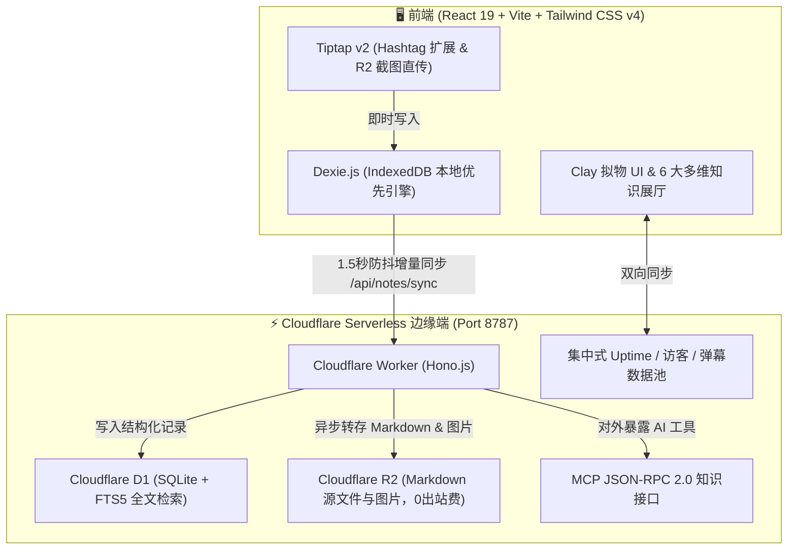

<div align="center">

# 🌸 TagMesh

### **无文件夹、无标题、全键盘驱动的粘土拟物风 Markdown 灵感手账**

*Organize knowledge organically through `#hashtags` — zero folders, zero title fatigue.*

<br/>

[](https://react.dev/)
[](https://tailwindcss.com/)
[](https://workers.cloudflare.com/)
[](https://developers.cloudflare.com/d1/)
[](https://developers.cloudflare.com/r2/)
[](https://modelcontextprotocol.io/)
[](./LICENSE)

<br/>

[✨ 核心特性](#-核心特性) • [🎨 6大次元主题](#-6-大心境次元主题) • [🧭 6大多维展厅](#-6-大多维知识展厅) • [💬 实时弹幕与遥测](#-跨设备实时弹幕与权威遥测) • [⚡ 快捷键指南](#-全键盘极速快捷键) • [🤖 MCP AI对接](#-model-context-protocol-mcp-服务端) • [🚀 快速开始](#-快速开始与本地开发)

<br/>

[🇨🇳 简体中文](./README_CN.md) • [🇬🇧 English](./README.md)

---

</div>

> [!TIP]
> **TagMesh 在 30 秒内能为你带来什么？**  
> 彻底抛弃“写之前必须想个标题”的纠结与“笔记该归到哪个文件夹”的归档内耗。随手敲下快捷键直接开写，在正文中任意穿插 `#标签`，系统将自动利用力导向图把所有碎片化灵感编织成双向网状星系。

<br/>

## 🌟 核心特性

- 🏷️ **零标题 & 零文件夹（Zero Folders & Titles）**：以纯粹 Markdown 文本流为核心，分类全靠正文中的 `#标签`，首行自动智能提炼为摘要卡片。
- 🎨 **粘土拟物手账风（Claymorphism）**：饱满圆润的胶囊微交互、物理空间浮雕投影、清脆听觉反馈与 Confetti 粒子。
- 💬 **跨设备实时弹幕广场**：手机端发射的灵感弹幕秒级飞过电脑屏幕，爱心点赞跨端广播，智能防碰撞宽距分轨。
- ⏱️ **真实系统后台运行时间（Authoritative Uptime）**：记录后台服务守护进程的真实启动时间戳，多终端秒级同步，刷新永不归零。
- 👥 **权威会话去重访客统计**：基于 Session 独立会话进行跨终端去重，自动维护总访客与今日访客（跨天自动重置）。
- 🧭 **6 大多维知识展厅**：Bento 拼图、3D 空间立体轮播、银河知识拓扑星网、拍立得手账墙、时光长河纪年与自由画布。
- ⚡ **全键盘极速驱动**：`Cmd+K` 全局命令中枢、`Cmd+\` 侧边栏、`Cmd+N` 极速新建、`#` 智能补全已有标签。
- 🤖 **原生 Serverless MCP 接口**：开放 8 大标准 AI 工具，零内置 AI 杂音，一键对接 Claude Desktop 与 Cursor。

---

## ⚖️ 设计哲学对比

```
       #旅行随笔                   #灵感闪念
          \                         /
           \------- [ 纯粹手账 ] ----/
          /         /      \       \
     #摄影光影     /        \     #cloudflare
                  /          \
             #治愈日记       #todo待办
```

| 传统笔记工具的困扰 😫 | TagMesh 的革新解法 ✨ |
| :--- | :--- |
| **起标题纠结**：记录一个闪念必须先想一个“恰当”的标题 | **零标题实体**：直接落笔书写，首行正文自动提炼为精致预览摘要 |
| **文件夹分类焦虑**：层级太深找不到，分类归属模棱两可 | **纯 `#标签` 网状拓扑**：在文本任意位置敲 `#标签`，自动聚合成双向网状索引 |
| **设备数据孤岛**：电脑写的内容手机看不了，状态统计混乱 | **边缘/局域网双向同步**：跨设备秒级同步，真实系统后台运行时长与权威访客去重统计 |
| **枯燥冰冷的界面**：黑白单调的 Markdown 缺乏温度与书写欲 | **Clay 拟物手账风**：饱满圆润的胶囊微交互、立体浮雕投影、清脆拟真音效与次元主题 |
| **内置臃肿的 AI 问答**：污染笔记界面，无法联动外部生产力工具 | **纯净 Serverless MCP 接口**：零内置冗余 AI，原生开放 8 大工具供 Claude Desktop / Cursor 直连 |

---

## 🎨 6 大心境次元主题

点击右上角主题切换胶囊或按下快捷键，即可在 6 种沉浸式心境次元中无缝穿梭：

| 次元主题 | 氛围特征 | 主色调 / 质感 | 适用心境 |
| :--- | :--- | :--- | :--- |
| 🌸 **樱花落雪 (Sakura Snow)** | 漫天飞樱与轻粉微光 | `#FFF5F7` · 柔粉温润 | 治愈手账、日常随想 |
| 🌊 **深海鲸落 (Deep Ocean)** | 深蓝浩瀚与海浪波纹 | `#F0F9FF` · 幽蓝静谧 | 深度思考、技术架构 |
| 🍵 **静谧抹茶 (Zen Matcha)** | 初春茶园与草木清香 | `#F2FBF5` · 自然草木 | 读书笔记、早晨复盘 |
| 🌌 **星际银河 (Cosmic Nebula)** | 星轨流转与深空紫韵 | `#FDF4FF` · 梦幻紫调 | 灵感碰撞、头脑风暴 |
| 👑 **鎏金宫殿 (Gilded Palace)** | 宫廷琥珀与奢雅丝绒 | `#FFFBEB` · 暖金质感 | 成果复盘、重要归档 |
| 🍦 **香草手账 (Vanilla Paper)** | 温暖奶油与手作纸质 | `#FAF7F2` · 质朴纸香 | 复古随笔、极简专注 |

---

## 🧭 6 大多维知识展厅

<div align="center">

| 展厅视图 | 交互特色 | 最佳适用场景 |
| :--- | :--- | :--- |
| **🗂️ 治愈 Bento 拼图** | 响应式便签网格，内置标签过滤与字数密度指示 | 快速浏览全库笔记与标签筛选 |
| **🎡 3D 梦幻立体轮播** | 空间圆柱立体旋转卡牌，支持键盘左右无缝切碟 | 沉浸式逐篇翻阅与灵感抽屉 |
| **🌌 银河知识拓扑星网** | 基于力导向图的网状星系，直观展示标签与笔记共生网 | 探索碎片笔记之间的隐式网状关联 |
| **🖼️ 拍立得手账照片墙** | 随机微倾角的手账卡片，带有真实回形针与纸质纹理 | 灵感画板与生活记忆墙 |
| **📅 时光长河纪年纪事** | 按时间流淌串联思考脉络，直观展示知识沉淀轨迹 | 长期思考演化与历史回溯 |
| **🎨 自由空间漂浮画布** | 自由拖拽摆放的无限灵感空间，打破条框束缚 | 头脑风暴与自由卡片布局 |

</div>

---

## 💬 跨设备实时弹幕与权威遥测

- **跨端实时互通**：在手机端发射一条弹幕，电脑屏幕即刻同步飞过；点赞 💖 实时跨端广播。
- **智能防碰撞分轨**：自适应移动端（4 轨）与桌面端（6 轨）宽距分流，配备馆长一键式快捷内容管理。
- **真实系统运行时间 (Uptime)**：记录服务端真实启动时间戳 `SYSTEM_START_TIME`，电脑与手机真机秒级同步展示实际在线寿命（如 `8h 48m 32s`），刷新页面不归零。
- **权威访客记录 (Session Deduplication)**：基于 Session 会话进行跨端去重，自动维护总访客与今日访客（跨天自动重置）。

---

## ⚡ 全键盘极速快捷键

TagMesh 专为键盘流设计，99% 的操作无需离开主键区：

| 快捷键 | 作用说明 | 触发范围 |
| :--- | :--- | :--- |
| <kbd>Cmd</kbd> + <kbd>K</kbd> / <kbd>Ctrl</kbd> + <kbd>K</kbd> | **唤起全局命令中枢**（支持 FTS5 全文搜索 / 输入直接回车建笔记） | 全局 |
| <kbd>Cmd</kbd> + <kbd>\</kbd> / <kbd>Ctrl</kbd> + <kbd>\</kbd> | **展开 / 收起左侧纯标签聚合侧边栏** | 全局 |
| <kbd>Cmd</kbd> + <kbd>N</kbd> / <kbd>Ctrl</kbd> + <kbd>N</kbd> | **极速新建空白手账**（100ms 快速响应） | 全局 |
| <kbd>Cmd</kbd> + <kbd>S</kbd> / <kbd>Ctrl</kbd> + <kbd>S</kbd> | **手动强制触发立即同步至 Cloudflare D1/R2** | 全局 |
| <kbd>#</kbd> | **键入 `#` 自动唤起已有标签智能补全建议菜单** | 编辑器内 |
| <kbd>Cmd</kbd> + <kbd>Shift</kbd> + <kbd>L</kbd> | **一键切换中英文双语界面**（English / 简体中文） | 全局 |
| <kbd>Cmd</kbd> + <kbd>/</kbd> / <kbd>Ctrl</kbd> + <kbd>/</kbd> | **打开全键盘快捷键速查面板** | 全局 |
| <kbd>Esc</kbd> | **关闭当前所有弹窗 / 命令中枢 / 侧边栏** | 全局 |

---

## 🤖 Model Context Protocol (MCP) 服务端

TagMesh 边缘端原生提供符合 **MCP 协议规范（JSON-RPC 2.0）** 的知识库接口，零内置 AI 杂音，专为外接顶级 AI 客户端设计。

### 🛠️ 开放的 8 大 MCP 核心工具

| 工具名称 (Tool) | 功能描述 (Description) | 输入参数 (Parameters) |
| :--- | :--- | :--- |
| `search_by_tag` | 按指定 `#标签` 精准检索笔记集合 | `tag` (string), `limit` (number) |
| `search_fulltext` | 跨所有手账执行 SQLite FTS5 全文关键词检索 | `query` (string), `limit` (number) |
| `read_note` | 通过 ID 获取单篇手账完整 Markdown 内容及标签元数据 | `id` (string) |
| `create_or_update_note` | 远程创建新笔记或全量覆盖指定手账 | `markdown` (string), `tags` (array), `id` (string) |
| `append_to_note` | 向已有手账平滑追加段落或新标签（极适合 AI 记录随想/待办） | `id` (string), `contentToAppend` (string), `additionalTags` (array) |
| `delete_note` | 归档或软删除指定手账 | `id` (string) |
| `list_tags` | 获取知识库中所有标签及其笔记引用频次热度榜 | 无 |
| `get_workspace_stats` | 查询知识库全局手账总数、总字数与健康指标 | 无 |

<details>
<summary><b>🔌 配置 Claude Desktop (点击展开)</b></summary>

在 Claude Desktop 配置文件 `claude_desktop_config.json` 中追加：

```json
{
  "mcpServers": {
    "tagmesh": {
      "command": "npx",
      "args": [
        "-y",
        "@modelcontextprotocol/server-fetch",
        "http://127.0.0.1:8787/mcp"
      ]
    }
  }
}
```
</details>

<details>
<summary><b>🔌 配置 Cursor / VSCode Cline (点击展开)</b></summary>

在 Cursor Settings -> Features -> MCP Servers 中添加：
- **Type**: `sse` / `http`
- **URL**: `http://127.0.0.1:8787/mcp`
</details>

---

## 🏗️ 全栈边缘架构



---

## 🚀 快速开始与本地开发

### 1. 克隆与安装依赖
```bash
git clone https://github.com/SaulGoodManC99/TagMesh.git
cd TagMesh
npm install
```

### 2. 启动本地开发服务
```bash
# 启动前端开发服务器（支持局域网 0.0.0.0:5173 真机访问）
npm run dev

# 启动 Cloudflare Worker 后端守护服务（端口 8787）
npm run worker:dev
```

### 3. 生产构建打包
```bash
# 执行 TypeScript 校验与 Vite 生产构建打包
npm run build
```

### 4. 初始化数据库与一键部署
```bash
# 初始化本地 Cloudflare D1 数据库与 FTS5 虚拟表
npm run db:init

# 部署至 Cloudflare Workers 边缘网络
npm run worker:deploy
```

---

## 📄 开源协议

本项目基于 [MIT License](./LICENSE) 协议开源。

<div align="center">

Crafted with 💖 and Clay Magic by **[SaulGoodManC99](https://github.com/SaulGoodManC99)**

</div>
