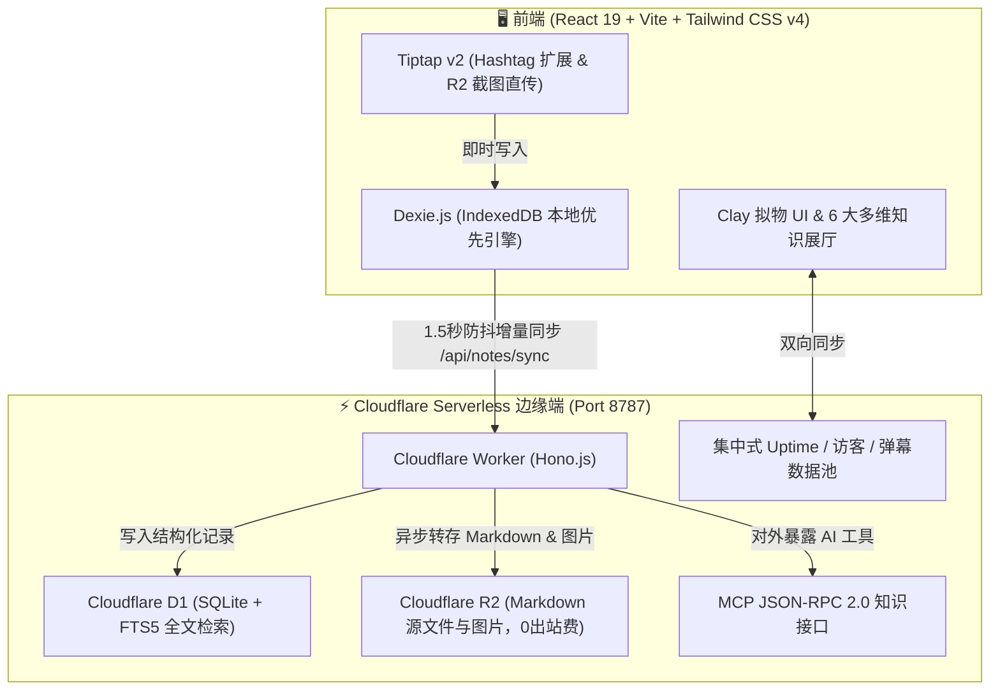

<div align="center">

# 🌸 TagMesh 灵感手账

### **无文件夹 · 无标题 · 依托 `#标签` 网状编织的粘土拟物风高性能 Markdown 知识空间**

*Ditch folders and titles. Weave thoughts organically through `#hashtags` at the edge.*

<br/>

[](https://react.dev/)
[](https://tailwindcss.com/)
[](https://workers.cloudflare.com/)
[](https://developers.cloudflare.com/d1/)
[](https://developers.cloudflare.com/r2/)
[](https://modelcontextprotocol.io/)
[](./LICENSE)

<br/>

[📖 项目诞生背景](#-项目诞生背景与设计哲学) • [✨ 核心特性矩阵](#-核心特性矩阵) • [🎨 6大心境次元](#-6-大心境次元主题) • [🧭 6大多维展厅](#-6-大多维知识展厅) • [⚡ 快捷键速查](#-全键盘极速快捷键) • [☁️ Cloudflare部署指南](#️-cloudflare-零到一保姆级部署指南) • [🤖 MCP AI对接](#-model-context-protocol-mcp-服务端)

<br/>

[🇨🇳 简体中文](./README_CN.md) • [🇬🇧 English](./README.md)

---

</div>

<br/>

> [!TIP]
> **💡 GitHub 仓库设置建议 (Repository Settings)**
> - **About 简介**：`🌸 彻底摒弃标题与文件夹、依托 #标签 网状编织的粘土拟物风（Claymorphic）高性能 Markdown 灵感手账。集成跨端实时弹幕、6大次元展厅与 Serverless MCP 接口。`
> - **Topics 标签**：`markdown`, `claymorphism`, `local-first`, `tiptap`, `cloudflare-workers`, `cloudflare-d1`, `cloudflare-r2`, `mcp-server`, `react19`, `tailwindcss4`, `notes-app`, `danmaku`

---

## 📖 项目诞生背景与设计哲学

我们在使用传统笔记工具（如 Notion、Obsidian、Logseq、Apple Notes）时，常常被以下 **三大隐形阻力** 打断心流：

```
       #旅行随笔                   #灵感闪念
          \                         /
           \------- [ 纯粹手账 ] ----/
          /         /      \       \
     #摄影光影     /        \     #cloudflare
                  /          \
             #治愈日记       #todo待办
```

1. **起标题纠结症（Title Writer's Block）**：在记下一句灵光一闪的想法前，系统非要你输入一个“合适”的标题。很多人卡在第一步，写作欲瞬间熄灭。
2. **文件夹层级地狱（The Folder Labyrinth）**：随着笔记增多，必须建立《工作/2026/项目A/会议记录》这样的深层树状目录。时间一长，笔记被深埋在目录深渊，找寻成本极高。
3. **内置 AI 杂音与枯燥 UI（AI Bloat & Cold Design）**：编辑器充斥着强行内置的 AI 续写弹窗，黑白冷淡风界面缺乏书写温度与情绪价值。

### 🌸 TagMesh 的解法：
- **无标题、无文件夹（Zero Titles & Folders）**：笔记即文本流。首行第一句话自动提炼为精致预览卡片；
- **行内 `#标签` 网状拓扑编织**：在正文中随处敲下 `#标签`，系统自动利用力导向图将其编织成双向网状知识星系；
- **粘土拟物（Claymorphism）温润美学**：立体浮雕阴影、清脆可爱的音效、Confetti 粒子、跨端实时弹幕广场与 6 大多维知识展厅；
- **纯净 Serverless MCP 知识库**：端内零 AI 杂音，通过原生 MCP 协议开放给外部 Claude Desktop 与 Cursor，让 AI 真正成为知识库的无缝外挂。

---

## ✨ 核心特性矩阵

<table>
  <tr>
    <td width="50%">
      <h3>🏷️ 零标题 & 零文件夹网状架构</h3>
      <p>彻底抛弃层级目录树。在 Markdown 任意位置键入 <code>#标签</code>，Tiptap 编辑器实时渲染为可点击交互的粘土胶囊，键入 <code>#</code> 自动唤起已有标签智能补全。</p>
    </td>
    <td width="50%">
      <h3>🎨 粘土拟物（Claymorphism）美学</h3>
      <p>圆润饱满的拟物按键、空间物理微交互、清脆敲击音效、粒子爆发以及 6 套深度调色的心境次元主题，赋予数字笔记温暖的手账触感。</p>
    </td>
  </tr>
  <tr>
    <td width="50%">
      <h3>💬 跨设备实时弹幕广场</h3>
      <p>手机端发射的弹幕即刻在电脑屏幕上流畅划过！点赞 💖 跨端实时广播，内置 4 轨/6 轨智能防碰撞算法与馆长一键式快捷审核下架。</p>
    </td>
    <td width="50%">
      <h3>⏱️ 真实后台系统运行时间与权威遥测</h3>
      <p>废弃前端单机假时间，由后端常驻进程记录真实的 <code>SYSTEM_START_TIME</code>，手机与电脑毫秒级同步展示实际在线寿命，刷新永不归零；基于 Session 独立会话进行跨终端访客权威去重。</p>
    </td>
  </tr>
  <tr>
    <td width="50%">
      <h3>🧭 6 大多维知识展厅视图</h3>
      <p>随心切换 <b>Bento 拼图</b>、<b>3D 空间立体轮播</b>、<b>银河知识拓扑星网</b>、<b>拍立得手账墙</b>、<b>时光长河纪年</b> 与 <b>自由漂浮画布</b>，多角度透视灵感。</p>
    </td>
    <td width="50%">
      <h3>🤖 原生 Serverless MCP AI 工具链</h3>
      <p>边缘端提供标准 Model Context Protocol（JSON-RPC 2.0）接口，开放 8 大生产级工具，供 <b>Claude Desktop</b> 与 <b>Cursor</b> 零门槛调用。</p>
    </td>
  </tr>
</table>

---

## 🎨 6 大心境次元主题

点击右上角主题胶囊或快捷键即可无缝切换全局色彩、氛围粒子与空间质感：

| 次元主题 | 视觉氛围 | 主色调 / 质感 | 最佳契合心境 |
| :--- | :--- | :--- | :--- |
| 🌸 **樱花落雪 (Sakura Snow)** | 漫天飞樱与轻粉微光 | `#FFF5F7` · 柔粉温润 | 治愈手账、日常随想 |
| 🌊 **深海鲸落 (Deep Ocean)** | 深蓝浩瀚与海浪波纹 | `#F0F9FF` · 幽蓝静谧 | 深度思考、技术架构 |
| 🍵 **静谧抹茶 (Zen Matcha)** | 初春茶园与草木清香 | `#F2FBF5` · 自然草木 | 读书笔记、早晨复盘 |
| 🌌 **星际银河 (Cosmic Nebula)** | 星轨流转与深空紫韵 | `#FDF4FF` · 梦幻紫调 | 灵感碰撞、头脑风暴 |
| 👑 **鎏金宫殿 (Gilded Palace)** | 宫廷琥珀与奢雅丝绒 | `#FFFBEB` · 暖金质感 | 成果复盘、重要归档 |
| 🍦 **香草手账 (Vanilla Paper)** | 温暖奶油与手作纸质 | `#FAF7F2` · 质朴纸香 | 复古随笔、极简专注 |

---

## 🧭 6 大多维知识展厅

| 展厅视图 | 交互特色 | 最佳适用场景 |
| :--- | :--- | :--- |
| **🗂️ 治愈 Bento 拼图** | 响应式便签网格，内置标签过滤与字数密度指示 | 快速浏览全库笔记与标签筛选 |
| **🎡 3D 梦幻立体轮播** | 空间圆柱立体旋转卡牌，支持键盘左右无缝切碟 | 沉浸式逐篇翻阅与灵感抽屉 |
| **🌌 银河知识拓扑星网** | 基于力导向图的网状星系，直观展示标签与笔记共生网 | 探索碎片笔记之间的隐式网状关联 |
| **🖼️ 拍立得手账照片墙** | 随机微倾角的手账卡片，带有真实回形针与纸质纹理 | 灵感画板与生活记忆墙 |
| **📅 时光长河纪年纪事** | 按时间流淌串联思考脉络，直观展示知识沉淀轨迹 | 长期思考演化与历史回溯 |
| **🎨 自由空间漂浮画布** | 自由拖拽摆放的无限灵感空间，打破条框束缚 | 头脑风暴与自由卡片布局 |

---

## ⚡ 全键盘极速快捷键

TagMesh 专为高阶键盘操作者打造，99% 的操作无需离开主键区：

| 快捷键 | 作用说明 | 触发范围 |
| :--- | :--- | :--- |
| <kbd>Cmd</kbd> + <kbd>K</kbd> / <kbd>Ctrl</kbd> + <kbd>K</kbd> | **唤起全局命令中枢**（支持 FTS5 全文搜索 / 输入直接回车建笔记） | 全局 |
| <kbd>Cmd</kbd> + <kbd>\</kbd> / <kbd>Ctrl</kbd> + <kbd>\</kbd> | **展开 / 收起左侧纯标签聚合侧边栏** | 全局 |
| <kbd>Cmd</kbd> + <kbd>N</kbd> / <kbd>Ctrl</kbd> + <kbd>N</kbd> | **极速新建空白手账**（100ms 快速响应） | 全局 |
| <kbd>Cmd</kbd> + <kbd>S</kbd> / <kbd>Ctrl</kbd> + <kbd>S</kbd> | **手动强制触发立即同步至 Cloudflare D1/R2** | 全局 |
| <kbd>#</kbd> | **键入 `#` 自动唤起已有标签智能补全建议菜单** | 编辑器内 |
| <kbd>Cmd</kbd> + <kbd>Shift</kbd> + <kbd>L</kbd> | **一键切换中英文双语界面**（English / 简体中文） | 全局 |
| <kbd>Cmd</kbd> + <kbd>/</kbd> / <kbd>Ctrl</kbd> + <kbd>/</kbd> | **打开全键盘快捷键速查面板** | 全局 |
| <kbd>Esc</kbd> | **关闭当前所有弹窗 / 命令中枢 / 侧边栏** | 全局 |

---

## ☁️ Cloudflare 零到一保姆级部署指南

TagMesh 完美适配 **Cloudflare 全套 Serverless 基础设施**（Workers + D1 SQLite 数据库 + R2 零出站费存储）。以下是完整的零到一部署教程：

### 🛠️ 步骤 1：安装依赖与登录 Cloudflare 账号
确保本地已安装 [Node.js (v18+)](https://nodejs.org/) 与 Git，然后执行：

```bash
# 1. 克隆代码仓库
git clone https://github.com/SaulGoodManC99/TagMesh.git
cd TagMesh

# 2. 安装项目全部依赖
npm install

# 3. 登录 Cloudflare 账号（会调起浏览器完成 OAuth 授权）
npx wrangler login
```

---

### 🗄️ 步骤 2：创建 Cloudflare D1 数据库
D1 是 Cloudflare 提供的边缘 SQLite 数据库，具备极高的读写性能：

```bash
# 创建名为 tagmesh-db 的数据库
npx wrangler d1 create tagmesh-db
```

执行后终端会输出类似如下内容：
```text
✅ Successfully created DB 'tagmesh-db'!
[[d1_databases]]
binding = "DB"
database_name = "tagmesh-db"
database_id = "xxxxxxxx-xxxx-xxxx-xxxx-xxxxxxxxxxxx"
```

👉 **修改 `wrangler.toml` 文件**：将终端输出的 `database_id` 替换填入项目根目录 `wrangler.toml` 文件的第 14 行中。

---

### 📜 步骤 3：初始化数据库表结构与 FTS5 虚拟表
执行项目自带的 `schema.sql`，一键初始化笔记表、索引以及 FTS5 全文搜索虚拟表：

```bash
# 在远程 Cloudflare D1 数据库执行建表 SQL
npm run db:init:remote
```

---

### 📦 步骤 4：创建 Cloudflare R2 对象存储桶
R2 用于存储粘贴的图片与 Markdown 备份文件，**享有 0 出站流量费**：

```bash
# 创建名为 tagmesh-markdown-assets 的存储桶
npx wrangler r2 bucket create tagmesh-markdown-assets
```

---

### 🚀 步骤 5：构建前端产物并一键部署至边缘网络

```bash
# 1. 编译前端生产包（产物自动输出至 dist/）
npm run build

# 2. 一键发布部署到 Cloudflare Workers 边缘网络
npm run worker:deploy
```

部署成功后，终端将输出您的专属线上访问域名，例如：  
`https://tagmesh-markdown.<你的子域名>.workers.dev`

---

### 🌐 步骤 6：绑定自定义域名（可选）
1. 登录 [Cloudflare Dashboard](https://dash.cloudflare.com/)；
2. 进入 **Workers & Pages** -> 选择 **tagmesh-markdown**；
3. 点击 **Settings** -> **Domains & Routes** -> **Add Custom Domain**，输入你的自定义域名（如 `notes.yourdomain.com`）即可秒级生效！

---

## 🤖 Model Context Protocol (MCP) 服务端

TagMesh 在 `/mcp` 原生提供符合标准 **Model Context Protocol (JSON-RPC 2.0)** 规范的端点，让外部 AI 客户端直接把 TagMesh 当作高响应、无损格式的第二大脑。

### 🛠️ 开放的 8 大 MCP 核心工具

| 工具名称 (Tool) | 功能说明 (Description) | 参数列表 (Parameters) |
| :--- | :--- | :--- |
| `search_by_tag` | 按指定 `#标签` 精准检索笔记集合 | `tag` (string), `limit` (number) |
| `search_fulltext` | 跨所有手账执行 SQLite FTS5 全文关键词检索 | `query` (string), `limit` (number) |
| `read_note` | 通过 ID 获取单篇手账完整 Markdown 内容及标签元数据 | `id` (string) |
| `create_or_update_note` | 远程创建新笔记或全量覆盖指定手账 | `markdown` (string), `tags` (array), `id` (string) |
| `append_to_note` | 向已有手账平滑追加段落或新标签（极适合 AI 记录随想/待办） | `id` (string), `contentToAppend` (string), `additionalTags` (array) |
| `delete_note` | 归档或软删除指定手账 | `id` (string) |
| `list_tags` | 获取知识库中所有标签及其笔记引用频次热度榜 | 无 |
| `get_workspace_stats` | 查询知识库全局手账总数、总字数与健康指标 | 无 |

<details>
<summary><b>🔌 配置 Claude Desktop (点击展开)</b></summary>

在 Claude Desktop 配置文件 `claude_desktop_config.json` 中追加：

```json
{
  "mcpServers": {
    "tagmesh": {
      "command": "npx",
      "args": [
        "-y",
        "@modelcontextprotocol/server-fetch",
        "https://你的域名/mcp"
      ]
    }
  }
}
```
</details>

<details>
<summary><b>🔌 配置 Cursor / VSCode Cline (点击展开)</b></summary>

在 Cursor Settings -> Features -> MCP Servers 中添加：
- **Type**: `sse` / `http`
- **URL**: `https://你的域名/mcp`
</details>

---

## 🏗️ 全栈边缘架构



---

## 📄 开源协议

本项目基于 [MIT License](./LICENSE) 协议开源。欢迎提交 Issue 与 Pull Request！

<div align="center">

Crafted with 💖 and Clay Magic by **[SaulGoodManC99](https://github.com/SaulGoodManC99)**

</div>
