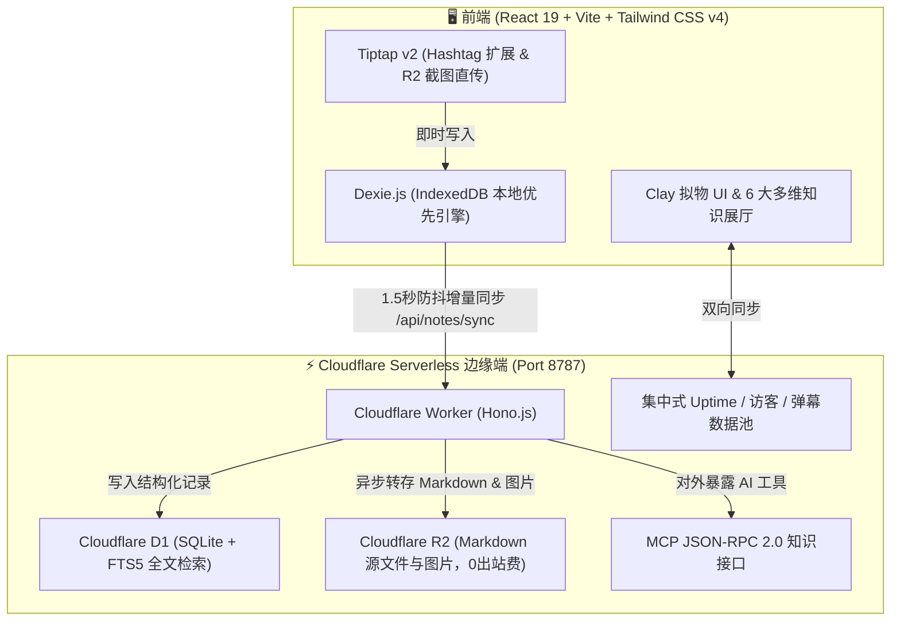

<div align="center">

# 🌸 TagMesh 灵感手账
### *Zero-Folder, Titleless, Keyboard-Driven Markdown Journal with Claymorphic Aesthetics & Serverless Edge*

<br/>

[](https://react.dev/)
[](https://tailwindcss.com/)
[](https://workers.cloudflare.com/)
[](https://developers.cloudflare.com/d1/)
[](https://developers.cloudflare.com/r2/)
[](https://modelcontextprotocol.io/)
[](https://opensource.org/licenses/MIT)

<br/>

**彻底告别“起标题纠结症”与“树状文件夹整理焦虑”。**  
随时随地按下快捷键，在 Markdown 正文中键入 `#标签`，灵感即刻织成璀璨星网。  
集成了**粘土拟物（Claymorphism）治愈美学**、**跨端实时弹幕广场**、**6 大多维知识展厅**与 **Serverless MCP AI 知识接口**。

[🇨🇳 简体中文](./README_CN.md) • [🇬🇧 English](./README.md)

</div>

---

## 📖 目录

- [🌟 为什么选择 TagMesh？（核心痛点与革新）](#-为什么选择-tagmesh核心痛点与革新)
- [🎨 粘土拟物（Claymorphism）与 6 大心境次元主题](#-粘土拟物claymorphism与-6-大心境次元主题)
- [💬 跨设备实时弹幕广场与真实系统遥测](#-跨设备实时弹幕广场与真实系统遥测)
- [🧭 6 大多维知识展厅视图](#-6-大多维知识展厅视图)
- [⚡ 全键盘极速工作流 (Keyboard-First)](#-全键盘极速工作流-keyboard-first)
- [🤖 Model Context Protocol (MCP) AI 工具链对接](#-model-context-protocol-mcp-ai-工具链对接)
- [🏗️ 全栈边缘架构 (Architecture)](#️-全栈边缘架构-architecture)
- [🚀 本地开发与极速部署](#-本地开发与极速部署)
- [📄 开源协议](#-开源协议)

---

## 🌟 为什么选择 TagMesh？（核心痛点与革新）

在日常笔记记录中，我们常常被繁琐的仪式感打断思考。TagMesh 用全新的设计哲学打破传统：

| 传统笔记工具的困扰 😫 | TagMesh 的革新解法 ✨ |
| :--- | :--- |
| **起标题纠结**：记录一个闪念必须先想一个“恰当”的标题 | **零标题实体**：直接落笔书写，首行正文自动提炼为精致预览摘要 |
| **文件夹分类焦虑**：层级太深找不到，分类归属模棱两可 | **纯 `#标签` 网状拓扑**：在文本任意位置敲 `#标签`，自动聚合成双向网状索引 |
| **设备数据孤岛**：电脑写的内容手机看不了，状态统计混乱 | **局域网/边缘双向同步**：跨设备秒级同步，真实系统后台运行时长与权威访客去重统计 |
| **枯燥冰冷的界面**：黑白单调的 Markdown 缺乏温度与书写欲 | **Clay 拟物手账风**：饱满圆润的胶囊微交互、立体浮雕投影、清脆拟真音效与次元主题 |
| **内置臃肿的 AI 问答**：污染笔记界面，无法联动外部生产力工具 | **纯净 Serverless MCP 接口**：零内置冗余 AI，原生开放 8 大工具供 Claude Desktop / Cursor 直连 |

```
       #旅行随笔                   #灵感闪念
          \                         /
           \------- [ 纯粹手账 ] ----/
          /         /      \       \
     #摄影光影     /        \     #cloudflare
                  /          \
             #治愈日记       #todo待办
```

---

## 🎨 粘土拟物（Claymorphism）与 6 大心境次元主题

TagMesh 采用柔和的 **粘土拟物设计（Claymorphism）** 与空间物理微交互。每次轻触、悬停与敲击均伴随粒子飞舞与清爽的听觉回馈。

系统预设 **6 种沉浸式心境次元主题**，一键切换全局色彩、氛围粒子与光影：

- 🌸 **樱花落雪 (Sakura Snow)**：漫天飞樱与轻粉微光，温润治愈。
- 🌊 **深海鲸落 (Deep Ocean)**：深蓝浩瀚与海浪波纹，静心专注。
- 🍵 **静谧抹茶 (Zen Matcha)**：初春茶园与草木清香，舒适自然。
- 🌌 **星际银河 (Cosmic Nebula)**：星轨流转与深空紫韵，灵感迸发。
- 👑 **鎏金宫殿 (Gilded Palace)**：宫廷琥珀与奢雅丝绒，华贵端庄。
- 🍦 **香草手账 (Vanilla Paper)**：温暖奶油与手作纸质，复古质朴。

---

## 💬 跨设备实时弹幕广场与真实系统遥测

### 1. 🚀 跨端实时弹幕广场
- **沉浸式灵感漂流**：社群留言、心情火花与公开手账摘录化作流光弹幕穿梭于多轨道舞台。
- **多端数据统一互通**：手机端发射的弹幕，电脑屏幕即刻同步飞过；点赞 💖 跨端实时广播。
- **智能防碰撞分轨**：自适应移动端（4 轨）与桌面端（6 轨）宽距分流，配备馆长一键式快捷内容管理。

### 2. ⏱️ 真实后台系统运行时间 (Real Uptime)
- 彻底告别单机假时间，由后端服务进程记录真实启动时间戳 `SYSTEM_START_TIME`，电脑与手机真机秒级同步展示后台实际运行寿命（如 `8h 48m 32s`），刷新页面永不重置归零。

### 3. 👥 权威访客记录机制 (Session Deduplication)
- 服务端基于 Session 独立会话进行跨端权威去重，自动维护 `总访客量` 与 `今日访客量`（自然日跨天自动清零），多端数据完全一致。

---

## 🧭 6 大多维知识展厅视图

随心切换 6 种不同维度的知识可视化空间：

1. **🗂️ 治愈 Bento 拼图（Bento Grid）**：自适应现代化便签网格，内置标签过滤与字数密度指示。
2. **🎡 3D 梦幻轮播（3D Carousel）**：空间圆柱立体旋转卡牌，支持键盘左右无缝换碟。
3. **🌌 银河知识星网（Galaxy Mesh）**：基于力导向图的网状拓扑星系，直观展示标签与笔记之间的共生关系。
4. **🖼️ 拍立得手账墙（Polaroid Board）**：随机倾角的手账拍立得卡片与回形针纸质纹理。
5. **📅 时光长河纪年（Timeline Stream）**：按时间流淌串联思考脉络。
6. **🎨 自由漂浮画布（Floating Canvas）**：自由拖拽的无限灵感空间。

---

## ⚡ 全键盘极速工作流 (Keyboard-First)

TagMesh 专为高阶键盘操作者打造，99% 的操作无需离开主键区：

| 快捷键 | 作用说明 | 触发场景 |
| :--- | :--- | :--- |
| **`Cmd + K` / `Ctrl + K`** | 唤起全局命令中枢 (支持 FTS5 全文检索 / 输入直接回车建笔记) | 全局 |
| **`Cmd + \` / `Ctrl + \`** | 展开 / 收起左侧纯标签聚合侧边栏 | 全局 |
| **`Cmd + N` / `Ctrl + N`** | 极速新建空白手账（100ms 快速响应） | 全局 |
| **`Cmd + S` / `Ctrl + S`** | 强制触发立即同步至 Cloudflare D1/R2 | 全局 |
| **`#`** | 键入 `#` 自动唤起已有标签智能补全下拉菜单 | 编辑器内 |
| **`Cmd + Shift + L`** | 一键切换中英文双语界面 (English / 简体中文) | 全局 |
| **`Cmd + /` / `Ctrl + /`** | 打开全键盘快捷键速查面板 | 全局 |
| **`Esc`** | 关闭当前所有弹窗 / 命令中枢 / 侧边栏 | 全局 |

---

## 🤖 Model Context Protocol (MCP) AI 工具链对接

TagMesh 在边缘端原生提供符合 **MCP 协议规范（JSON-RPC 2.0）** 的知识库接口，零内置 AI 杂音，专为外接顶级 AI 客户端设计。

### 🛠️ 开放的 8 大 MCP 核心工具

| 工具名称 (Tool Name) | 功能描述 (Description) |
| :--- | :--- |
| `search_by_tag` | 按指定 `#标签` 精准检索手账集合 |
| `search_fulltext` | 跨所有手账执行 SQLite FTS5 全文关键词检索 |
| `read_note` | 通过 ID 获取单篇手账完整 Markdown 内容及标签元数据 |
| `create_or_update_note` | 远程创建新笔记或全量覆盖指定手账 |
| `append_to_note` | **(新)** 给已有手账追加段落或新标签（极适合 AI 记录随想/待办） |
| `delete_note` | **(新)** 归档或软删除指定手账 |
| `list_tags` | **(新)** 获取知识库中所有标签及其笔记引用频次榜 |
| `get_workspace_stats` | **(新)** 查询知识库全局手账总数、总字数与健康指标 |

### 🔌 配置 Claude Desktop (`claude_desktop_config.json`)

```json
{
  "mcpServers": {
    "tagmesh": {
      "command": "npx",
      "args": [
        "-y",
        "@modelcontextprotocol/server-fetch",
        "http://127.0.0.1:8787/mcp"
      ]
    }
  }
}
```

---

## 🏗️ 全栈边缘架构 (Architecture)



---

## 🚀 本地开发与极速部署

### 1. 环境准备
- [Node.js](https://nodejs.org/) (推荐 v18+)
- [Git](https://git-scm.com/)

### 2. 克隆与安装依赖
```bash
git clone https://github.com/SaulGoodManC99/TagMesh.git
cd TagMesh
npm install
```

### 3. 本地启动服务
```bash
# 启动前端开发服务器（支持局域网 0.0.0.0:5173 真机访问）
npm run dev

# 启动 Cloudflare Worker 后端守护服务（端口 8787）
npm run worker:dev
```

### 4. 生产构建打包
```bash
# 执行 TypeScript 校验与 Vite 构建打包
npm run build
```

### 5. 初始化数据库与一键部署
```bash
# 初始化本地 Cloudflare D1 数据库与 FTS5 虚拟表
npm run db:init

# 部署至 Cloudflare Workers 边缘网络
npm run worker:deploy
```

---

## 📄 开源协议

本项目基于 [MIT License](./LICENSE) 协议开源。

<div align="center">

Crafted with 💖 and Clay Magic by **[SaulGoodManC99](https://github.com/SaulGoodManC99)**

</div>
