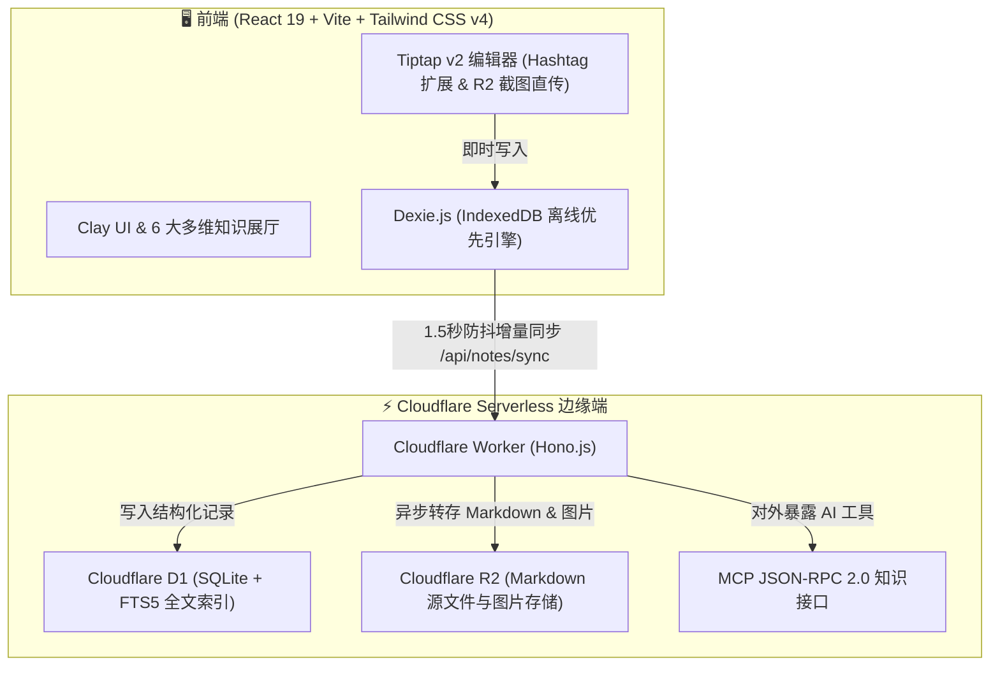

# TagMesh 灵感手账 🌸

<div align="center">

[](https://react.dev/)
[](https://tailwindcss.com/)
[](https://workers.cloudflare.com/)
[](https://developers.cloudflare.com/d1/)
[](https://developers.cloudflare.com/r2/)
[](https://dexie.org/)
[](https://opensource.org/licenses/MIT)

**彻底摒弃“标题”与“文件夹”、全键盘驱动、依托 `#标签` 网状编织的粘土拟物风（Claymorphic）高性能 Markdown 灵感笔记系统。**  
集成了跨设备多端实时同步、沉浸式弹幕广场、6 大次元展厅视图与 Serverless MCP 知识库接口。

[简体中文](./README_CN.md) • [English](./README.md)

</div>

---

## 🌟 核心设计理念与特色

TagMesh 从根本上打破传统笔记工具的“文件夹层级焦虑”与“起标题纠结症”，通过**标签网状链接（Tag Mesh）**打造自然生长的知识花园。

```
       #旅行随笔                   #灵感闪念
          \                         /
           \------- [ 手账笔记 ] ----/
          /         /      \       \
     #摄影光影     /        \     #cloudflare
                  /          \
             #治愈日记       #todo待办
```

### 1. 🏷️ 无标题 & 无文件夹设计 (Zero Titles & Folders)
- **纯粹文本流**：彻底取消独立的 Title 实体与层级目录树。分类全靠正文中任意位置随手键入的 `#标签`（如 `#cloudflare`、`#架构`、`#摄影`）。
- **行内徽章实时渲染**：Tiptap 编辑器自动将 `#tag` 渲染为精致的 Clay 胶囊徽章，点击即可筛选标签笔记。
- **智能 `#` 补全建议**：键入 `#` 字符即刻唤起已有标签的智能补全下拉列表，标签复用零心智负担。

### 2. 🎨 粘土拟物美学（Claymorphism）与 6 大心境次元主题
- **治愈系触感设计**：圆润饱满的粘土胶囊、微交互浮雕阴影、清脆可爱的音效与 Confetti 粒子爆发。
- **6 大心境次元主题**：
  - 🌸 **樱花落雪**（漫天飞樱与轻粉微光）
  - 🌊 **深海鲸落**（幽蓝静谧与深海呼吸）
  - 🍵 **静谧抹茶**（初春茶园与草木清香）
  - 🌌 **星际银河**（星轨流转与深空紫韵）
  - 👑 **鎏金宫殿**（宫廷琥珀与奢雅丝绒）
  - 🍦 **香草手账**（温暖奶油与手作纸质）

### 3. 💬 跨设备多端实时弹幕广场
- **沉浸式灵感漂流**：社群留言、灵感火花与公开手账摘录化作流光弹幕穿梭于多轨道舞台。
- **多端数据统一互通**：手机端发射的弹幕，电脑屏幕即刻飞过；点赞💖与爱心粒子跨端实时同步。
- **智能防碰撞分轨**：自适应移动端（4轨）与桌面端（6轨）宽距分流，配备馆长一键式快捷内容管理。

### 4. 🧭 6 大多维知识展厅视图
- **🗂️ 治愈 Bento 拼图（Bento Grid）**：自适应现代化便签网格，内置标签过滤与字数密度指示。
- **🎡 3D 梦幻轮播（3D Carousel）**：空间圆柱立体旋转卡牌，支持键盘左右无缝切换。
- **🌌 银河知识星网（Galaxy Mesh）**：基于力导向图的网状拓扑星系，直观展示标签与笔记之间的双向共生链接。
- **🖼️ 拍立得手账墙（Polaroid Board）**：随机倾角的手账拍立得卡片与回形针纸质纹理。
- **📅 时光长河纪年（Timeline Stream）**：按时间流淌串联思考演进。
- **🎨 自由漂浮画布（Floating Canvas）**：自由拖拽的无限灵感空间。

### 5. ⚡ 全键盘驱动 & 全局命令中枢 (`Cmd + K`)
- **全局命令中枢 (`Cmd + K`)**：支持 D1 SQLite FTS5 全文搜索、按 `#` 搜标签、输入文字直接回车创建笔记（100ms 极速响应）。
- **极速快捷键引擎**：`Cmd + \` 呼出侧边栏、`Cmd + N` 极速新建、`Cmd + S` 手动立即同步、`Cmd + Shift + L` 切换中英双语。

### 6. 🔌 纯净 Serverless MCP 知识库接口
- 边缘端原生提供 `/mcp` 标准 Model Context Protocol（JSON-RPC 2.0）接口与 Bearer Token 鉴权。
- 供 **Claude Desktop**、**Cursor** 或任意外部 AI Agent 检索与写入知识库，零内置 AI 冗余界面。

---

## ⚡ 全键盘快捷键指南

| 快捷键 | 作用说明 | 触发场景 |
| :--- | :--- | :--- |
| **`Cmd + K` / `Ctrl + K`** | 唤起全局命令中枢 (全文搜索 / 输入直接回车建笔记) | 全局 |
| **`Cmd + \` / `Ctrl + \`** | 展开/收起左侧纯标签聚合侧边栏 | 全局 |
| **`Cmd + N` / `Ctrl + N`** | 极速新建空白手账 | 全局 |
| **`Cmd + S` / `Ctrl + S`** | 强制触发立即同步至 Cloudflare D1/R2 | 全局 |
| **`#`** | 唤起已有标签智能补全建议菜单 | 编辑器内 |
| **`Cmd + Shift + L`** | 一键切换中英文双语界面 (EN / 中文) | 全局 |
| **`Cmd + /` / `Ctrl + /`** | 打开快捷键说明面板 | 全局 |
| **`Esc`** | 关闭当前所有弹窗 / 命令面板 / 侧边栏 | 全局 |

---

## 🏗️ 全栈架构与技术栈



- **前端框架**：React 19、Vite、Tailwind CSS v4、Dexie.js (IndexedDB 本地优先)、Tiptap v2、`cmdk`、Lucide React。
- **后端架构**：Cloudflare Workers、Hono.js。
- **数据库**：Cloudflare D1 (SQLite + FTS5 全文检索虚拟表)。
- **对象存储**：Cloudflare R2 (0 出站流量费图片与 Markdown 存转)。
- **AI 协议**：Model Context Protocol (MCP) JSON-RPC 2.0。

---

## 🚀 极速上手与本地开发

### 1. 环境准备
- [Node.js](https://nodejs.org/) (推荐 v18+)
- [Wrangler CLI](https://developers.cloudflare.com/workers/wrangler/)（devDependencies 已集成）

### 2. 安装项目
```bash
# 克隆仓库
git clone https://github.com/SaulGoodManC99/TagMesh.git
cd TagMesh

# 安装依赖包
npm install
```

### 3. 本地启动开发环境
```bash
# 启动前端开发服务器 (支持局域网真机调试 0.0.0.0:5173)
npm run dev

# 启动 Cloudflare Worker 后端本地守护服务
npm run worker:dev
```

### 4. 编译生产包
```bash
# TypeScript 类型校验与 Vite 打包
npm run build
```

### 5. Cloudflare D1 数据库初始化与部署
```bash
# 初始化本地 D1 SQLite 表结构与 FTS5 虚拟表
npm run db:init

# 一键部署至 Cloudflare Workers 边缘网络
npm run worker:deploy
```

---

## 🤖 MCP（Model Context Protocol）接入配置

TagMesh 在 `/mcp` 端点提供标准 MCP 协议支持：

1. 在 **Claude Desktop** 配置文件中（`claude_desktop_config.json`）：
```json
{
  "mcpServers": {
    "tagmesh": {
      "command": "npx",
      "args": [
        "-y",
        "@modelcontextprotocol/server-fetch",
        "http://127.0.0.1:8787/mcp"
      ]
    }
  }
}
```

2. 开放的 MCP 工具集：
- `search_by_tag`：按指定 `#标签` 搜索过滤手账。
- `search_fulltext`：跨所有手账执行 FTS5 全文高级搜索。
- `read_note`：通过 ID 读取手账完整 Markdown 内容及元数据。
- `create_or_update_note`：远程创建或更新手账文本流。

---

## 📄 开源许可证

本项目基于 **MIT License** 开源。

<div align="center">
Crafted with 💖 and clay magic by <b>SaulGoodManC99</b>
</div>
