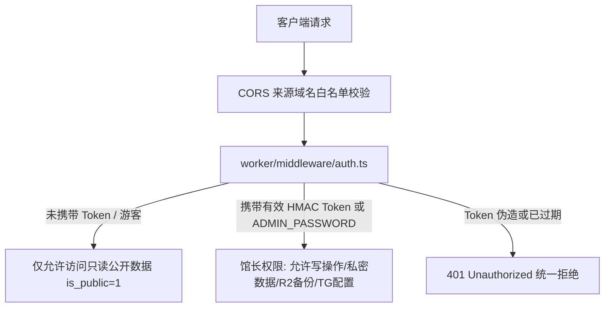

# 🛡️ TagMesh 安全漏洞修复与服务端鉴权升级报告 (SECURITY_CHANGES.md)

本文档记录了 TagMesh 系统（React + Cloudflare Workers + D1 + R2）在服务端鉴权、数据隔离、文件上传安全、CORS 白名单以及数据库结构迁移方面的完整安全加固详情。

---

## 🔐 一、核心安全架构升级 (P0 & P1)



### 1. 统一服务端鉴权中间件 (`worker/middleware/auth.ts`)
- **HMAC-SHA256 动态签名**：管理员通过 `/api/auth/login` 输入口令，服务端通过 Web Crypto API 签发包含过期时间戳与 HMAC-SHA256 签名的会话 Token（`tm_hmac_<expiresAt>.<signature>`），默认有效期 30 天；
- **时序攻击防御**：比对密码与签名时采用 `timingSafeEqual` 恒定时间算法；
- **零硬编码默认值**：彻底移除代码中所有 `'admin888'` 与 `'tagmesh_mcp_secret_bearer_token'` 兜底文本。若环境变量未配置 `ADMIN_PASSWORD` 或 `MCP_AUTH_TOKEN`，系统会记录安全告警日志并直接拒绝请求。

### 2. 接口权限矩阵与变动清单

| 路由模块 | 接口路径 | 请求方法 | 权限级别 | 安全防护说明 |
| :--- | :--- | :---: | :---: | :--- |
| **Auth 鉴权** | `/api/auth/login` | `POST` | 公开 | 馆长口令校验，签发 HMAC 会话 Token |
| | `/api/auth/verify` | `GET` | 需鉴权 | 校验前端持有的 Token 是否有效 |
| | `/api/auth/logout` | `POST` | 公开 | 退出登录 |
| **Notes 笔记** | `/api/notes/sync` | `POST` | **必须鉴权** | 强制要求馆长 Token，防止未授权写入与篡改 |
| | `/api/notes/:id` | `DELETE` | **必须鉴权** | 强制要求馆长 Token，防止未授权删除 |
| | `/api/notes/:id/like` | `POST` | 公开 | 允许全网访客与馆长进行笔记互动点赞 |
| | `/api/notes` | `GET` | 动态权限 | **服务端强制过滤**：游客状态下强制只返回 `is_public = 1` 的笔记；仅在携带有效管理员 Token 时才返回私密笔记 |
| | `/api/notes/search` | `GET` | 动态权限 | **服务端强制过滤**：游客状态下全文搜索与标签搜索仅匹配公开笔记 |
| | `/api/notes/:id` | `GET` | 动态权限 | 若为私密笔记，游客访问直接返回 404，防止枚举探测 |
| **Upload 上传** | `/api/upload` | `POST` | **必须鉴权** | 强制鉴权 + 仅限图片 MIME 白名单 + 单文件上限 5MB |
| | `/api/upload/backup` | `POST` | **必须鉴权** | 全库快照归档至 R2 |
| | `/api/upload/backups` | `GET` | **必须鉴权** | 查询 R2 云端快照列表 |
| | `/api/upload/restore` | `POST` | **必须鉴权** | 从 R2 读取历史快照 |
| | `/api/upload/status` | `GET` | **必须鉴权** | R2 存储桶连通性检测 |
| **Telegram 同步** | `/api/telegram/config` | `GET` | **必须鉴权** | 获取脱敏配置与 Bot 信息 |
| | `/api/telegram/config` | `POST` | **必须鉴权** | 保存 Bot Token 与白名单 User IDs |
| | `/api/telegram/set-webhook`| `POST` | **必须鉴权** | 注册 Telegram Webhook |
| | `/api/telegram/delete-webhook`| `POST` | **必须鉴权** | 解绑 Webhook |
| | `/api/telegram/test` | `POST` | **必须鉴权** | 发送测试消息 |
| | `/api/telegram/webhook` | `POST` | 公开 (受控)| Telegram 官方回调，按白名单 User IDs 过滤入库 |
| **MCP 网关** | `/mcp` | `POST` | **必须鉴权** | 严格校验 Bearer Token（支持 `MCP_AUTH_TOKEN` 或 `ADMIN_PASSWORD`） |
| **Telemetry 遥测** | `/api/telemetry/appearance` | `POST` | **必须鉴权** | 馆长设置全站默认外观与主题 |
| | `/api/telemetry/reset` | `POST` | **必须鉴权** | 馆长重置访问量与运行时间 |
| | `/api/telemetry` | `GET` | 公开 | 读取全站运行数据与默认主题 |
| | `/api/telemetry/visit` | `POST` | 公开 | 记录访客 UV/PV |
| | `/api/telemetry/stamp` | `POST` | 公开 | 全站互动足迹盖章 |

---

## 🛠️ 二、环境变量配置与部署命令

在部署上线或更新 Worker 前，请在终端执行以下命令设置安全密钥：

```bash
# 1. 设置管理员主口令（必填，用于 /api/auth/login 登录及管理所有接口）
npx wrangler secret put ADMIN_PASSWORD

# 2. 设置 MCP AI Agent 专用调用 Token（选填，不填时默认使用 ADMIN_PASSWORD）
npx wrangler secret put MCP_AUTH_TOKEN

# 3. 设置允许跨域的域名白名单（选填，多个用逗号隔开，默认已内置 tagmesh.top 与本地开发端口）
# npx wrangler secret put ALLOWED_ORIGINS
```

---

## 📦 三、数据库表结构变更 (`schema.sql`)

移除了业务运行路径（`notes.ts` / `telegram.ts` / `queries.ts`）中所有的动态 `ALTER TABLE` 兜底，将全套表结构归纳至 `schema.sql`：

1. **`notes` 表**：新增 `likes INTEGER NOT NULL DEFAULT 0` 列与相应索引；
2. **`system_settings` 表**：新增系统与 Telegram 配置存储表：
   ```sql
   CREATE TABLE IF NOT EXISTS system_settings (
       key TEXT PRIMARY KEY,
       value TEXT NOT NULL,
       updated_at INTEGER NOT NULL
   );
   ```

若对已有远程 D1 执行增量迁移，可执行：
```bash
npx wrangler d1 execute tagmesh-db --remote --command="ALTER TABLE notes ADD COLUMN likes INTEGER NOT NULL DEFAULT 0;"
npx wrangler d1 execute tagmesh-db --remote --command="CREATE TABLE IF NOT EXISTS system_settings (key TEXT PRIMARY KEY, value TEXT NOT NULL, updated_at INTEGER NOT NULL);"
```

---

## 💡 四、异常信息脱敏规范 (P1)

所有业务路由在发生异常时，统一通过 `console.error('[Module Error]', err)` 在 Cloudflare 实时日志中记录完整调用栈，向客户端统一返回通用的友好提示文案（如 `操作失败，请稍后重试`），杜绝泄露 D1/R2 的内部表名与堆栈细节。
